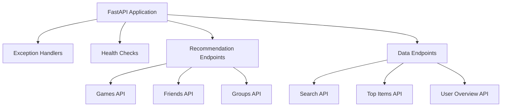
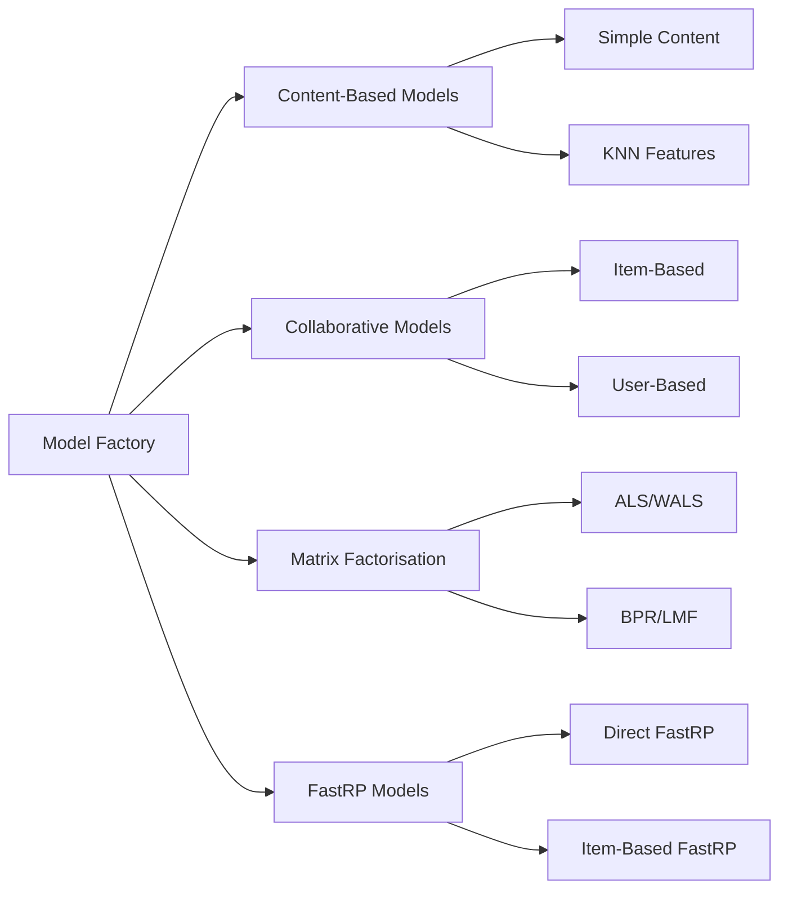
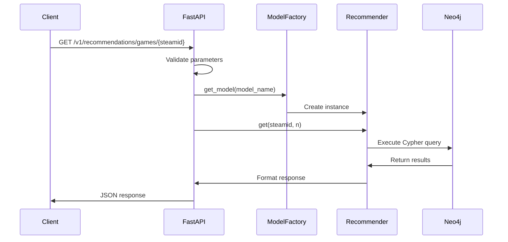

*From research prototype to production—design APIs that survive contact with reality*

Building a production-ready API for serving machine learning recommendations requires careful consideration of performance, scalability, and maintainability. This step-by-step tutorial explores how the Steam recommender system implements a robust FastAPI service that serves multiple recommendation algorithms whilst maintaining high availability and operational excellence.

## Step 1: FastAPI Architecture Foundation

### Setting Up the Core Application

Start with a well-structured FastAPI application that establishes clear patterns from the beginning:

```python
# app/main.py
from fastapi import FastAPI, HTTPException, Query
from fastapi.responses import JSONResponse
import logging

logging.basicConfig(level=logging.INFO)
logger = logging.getLogger(__name__)

app = FastAPI(
    title="Steam Recommendation API",
    description="Graph-based recommendation system for Steam games, friends, and groups",
    version="1.0.0",
)
```

**Key architectural decisions:**
- Centralised logging configuration
- Descriptive API metadata for automatic documentation
- Clear version management



### Exception Handling Strategy

Implement comprehensive exception handling at the application level:

```python
@app.exception_handler(Exception)
async def general_exception_handler(request, exc):
    """Handle unexpected exceptions."""
    logger.error(f"Unexpected error: {exc}")
    return JSONResponse(
        status_code=500,
        content={"detail": "Internal server error"}
    )
```

**Benefits:**
- Prevents internal error details from leaking to clients
- Ensures consistent error response format
- Comprehensive logging for debugging

## Step 2: Pydantic Interface Design

### Defining Response Models

Create type-safe interfaces using Pydantic models:

```python
# app/endpoints/interfaces.py
from typing import Any, Dict, List
from pydantic import BaseModel

class User(BaseModel):
    steamid: int
    personaname: str = None
    props: Dict[str, Any] = None  # Flexible property container

class Game(BaseModel):
    appid: int
    title: str = None
    props: Dict[str, Any] = None

class Games(BaseModel):
    games: List[Game]

class UserOverview(BaseModel):
    user: User
    top_games: List[Game] = None
    top_genres: List[Genre] = None
    friends: List[User] = None
    top_groups: List[Group] = None
```

**Design principles:**
- Optional fields with sensible defaults
- Flexible `props` field for extensibility
- Composite models for complex responses
- Type safety throughout the API

### Input Validation Patterns

Use FastAPI's built-in validation:

```python
@app.get("/v1/recommendations/games/{steamid}", response_model=Games)
def get_game_recommendations(
    steamid: str, 
    model: ModelNameApp, 
    n: int = Query(default=10, ge=1, le=100, description="Number of recommendations")
) -> Games:
    """Get game recommendations for a user."""
```

**Validation features:**
- Path parameter validation
- Query parameter constraints (`ge`, `le`)
- Enum validation for model names
- Automatic OpenAPI documentation

## Step 3: Model Factory Pattern

### Implementing the Factory

Create a flexible model factory for algorithm selection:

```python
# app/endpoints/recommendations/model_factory.py
from typing import Type
from endpoints.recommendations.base import Recommendation

class ModelFactory:
    def __init__(self):
        self._model = {}

    def register_model(self, model_name: ModelName, model: Type[Recommendation]):
        self._model[model_name] = model

    def get_model(self, model_name: str) -> Recommendation:
        model = self._model.get(model_name)
        if not model:
            raise ValueError(f"No model registered for {model_name}")
        return model()

# Global factory instance
model_factory = ModelFactory()

# Register models
model_factory.register_model(
    ModelNameApp.apps_collaborative_item_based,
    RecGamesCollaborativeItemBased
)
model_factory.register_model(
    ModelNameApp.apps_mf_als_weighted,
    RecGamesMFWALS
)
```

### Model Registration Strategy



**Benefits:**
- Easy addition of new algorithms
- Runtime model switching
- Clear separation of concerns
- Type-safe model instantiation

## Step 4: Database Connection Management

### Centralised Connection Handling

Implement robust database connectivity:

```python
# app/endpoints/base.py
from neo4j import Driver
from steam_recsys_common import get_neo4j_connection

class NeoQuery:
    """Base class for Neo4j database operations."""
    
    def __init__(self) -> None:
        self._conn: Driver = None

    @property
    def conn(self) -> Driver:
        if self._conn is None:
            self._conn = get_neo4j_connection()
        return self._conn

    def _cypher_to_dict(self, query: str, **params) -> List[Dict[str, Any]]:
        """Execute Cypher query and return results as dictionaries."""
        logger.info(f"Query params: {params}")
        with self.conn.session() as session:
            result = session.run(query, **params)
            return [record.data() for record in result]
```

### Connection Configuration

Use environment variables for configuration:

```bash
# Environment variables
NEO4J_HOST=localhost
NEO4J_AUTH=neo4j/password
```

>**NOTE**: If connecting from within the same docker-compose network, use the name of the Neo4J service as hostname: NEO4J_HOST=neo4j

**Connection features:**
- Lazy connection initialisation
- Connection pooling via Neo4j driver
- Robust retry logic in `steam_recsys_common`
- Environment-based configuration

## Step 5: Recommendation Serving Patterns

### Real-Time Query Execution

Implement real-time recommendation generation:

```python
@app.get("/v1/recommendations/games/{steamid}", response_model=Games)
def get_game_recommendations(
    steamid: str, 
    model: ModelNameApp, 
    n: int = Query(default=10, ge=1, le=100)
) -> Games:
    """Get game recommendations for a user."""
    try:
        recommender = model_factory.get_model(model_name=model)
        response = recommender.get(steamid=steamid, n=n)
        return response
    except Exception as e:
        logger.error(f"Failed to get recommendations for {steamid}: {e}")
        raise HTTPException(status_code=500, detail="Failed to generate recommendations")
```

### Bulk Operations Support

Handle multiple users efficiently:

```python
@app.get("/v1/recommendations/games/bulk", response_model=List[Games])
def get_bulk_game_recommendations(
    steamids: str = Query(..., description="Comma-separated Steam IDs"),
    model: ModelNameApp = ModelNameApp.apps_collaborative_item_based_unweighted,
    n: int = Query(default=10, ge=1, le=100)
) -> List[Games]:
    """Get recommendations for multiple users."""
    try:
        steamid_list = [sid.strip() for sid in steamids.split(",") if sid.strip()]
        
        # Validation
        if not steamid_list:
            raise HTTPException(status_code=400, detail="No valid Steam IDs provided")
        if len(steamid_list) > 50:  # Rate limiting
            raise HTTPException(status_code=400, detail="Too many Steam IDs (max 50)")
        
        recommender = model_factory.get_model(model_name=model)
        response = recommender.get_many(steamids=steamid_list, n=n)
        return response
    except HTTPException:
        raise
    except Exception as e:
        logger.error(f"Failed to get bulk recommendations: {e}")
        raise HTTPException(status_code=500, detail="Failed to generate recommendations")
```

## Step 6: Performance Optimisation

### Query Template System

Use parameterised queries for performance:

```cypher
-- Example recommendation query template
MATCH (n:USER {steamid:$steamid})-[p:PLAYED]->(a:APP)-[s:__SIMILAR_RELATION__]-(rec:APP)
WHERE NOT EXISTS((n)-[:PLAYED]-(rec)) AND p.playtime_forever > 0
WITH rec, sum(p.playtime_forever * s.score) / sum(p.playtime_forever) as score
ORDER BY score DESC
LIMIT $n
```

**Optimisation strategies:**
- Query plan caching
- Parameterised queries prevent SQL injection
- Relationship type templating for model flexibility
- Efficient filtering with existence checks

### Request/Response Flow



## Step 7: Health Monitoring and Observability

### Health Check Implementation

Add comprehensive health checks:

```python
@app.get("/health")
async def health_check():
    """Health check endpoint."""
    return {"status": "healthy", "service": "steam-recsys-api"}
```

### Logging Strategy

Implement structured logging:

```python
import logging

# Configure logging
logging.basicConfig(
    level=logging.INFO,
    format='%(asctime)s - %(name)s - %(levelname)s - %(message)s'
)
logger = logging.getLogger(__name__)

# Usage throughout the application
logger.info(f"Processing recommendation request for user {steamid}")
logger.error(f"Database connection failed: {e}")
```

### Error Handling Patterns

Implement layered error handling:

```python
def get_game_recommendations(steamid: str, model: ModelNameApp, n: int):
    try:
        # Business logic
        recommender = model_factory.get_model(model_name=model)
        response = recommender.get(steamid=steamid, n=n)
        return response
    except ValueError as e:
        # Client error - invalid model name
        logger.warning(f"Invalid model requested: {model}")
        raise HTTPException(status_code=400, detail=str(e))
    except ConnectionError as e:
        # Infrastructure error
        logger.error(f"Database connection failed: {e}")
        raise HTTPException(status_code=503, detail="Service temporarily unavailable")
    except Exception as e:
        # Unexpected error
        logger.error(f"Unexpected error: {e}")
        raise HTTPException(status_code=500, detail="Internal server error")
```

## Step 8: Production Deployment Considerations

### Docker Configuration

Set up production-ready containerisation:

```dockerfile
# api/Dockerfile
FROM python:3.12-slim

WORKDIR /app
COPY requirements.txt .
RUN pip install --no-cache-dir -r requirements.txt

COPY app/ ./app/
EXPOSE 8000

# Production server
CMD ["gunicorn", "app.main:app", "-w", "1", "-k", "uvicorn.workers.UvicornWorker", "--bind", "0.0.0.0:8000"]
```

### Environment Configuration

Configure for different environments:

```python
# Environment-based configuration
import os

class Settings:
    neo4j_host = os.getenv("NEO4J_HOST", "localhost")
    neo4j_auth = os.getenv("NEO4J_AUTH", "neo4j/password")
    log_level = os.getenv("LOG_LEVEL", "INFO")
    max_bulk_users = int(os.getenv("MAX_BULK_USERS", "50"))
```

## Step 9: API Documentation and Testing

### Automatic Documentation

FastAPI generates comprehensive documentation:

```python
# Accessible at /docs for Swagger UI
# Accessible at /redoc for ReDoc
app = FastAPI(
    title="Steam Recommendation API",
    description="""
    Graph-based recommendation system providing:
    - Game recommendations using multiple algorithms
    - Friend and group recommendations
    - Search and discovery endpoints
    """,
    version="1.0.0",
)
```

### Testing Strategy

Implement comprehensive testing:

```python
# Example test structure
import pytest
from fastapi.testclient import TestClient
from app.main import app

client = TestClient(app)

def test_health_check():
    response = client.get("/health")
    assert response.status_code == 200
    assert response.json()["status"] == "healthy"

def test_game_recommendations():
    response = client.get(
        "/v1/recommendations/games/76561198000000000",
        params={"model": "apps_collaborative_item_based", "n": 5}
    )
    assert response.status_code == 200
    assert "games" in response.json()
```

## Conclusion

Building a production-ready recommendation API requires balancing performance, maintainability, and operational excellence. The Steam recommender system demonstrates how to:

- **Structure APIs** using FastAPI's type system and validation
- **Manage complexity** through factory patterns and modular design
- **Ensure reliability** with comprehensive error handling and health checks
- **Maintain flexibility** with pluggable recommendation algorithms
- **Support operations** through logging, documentation, and monitoring
