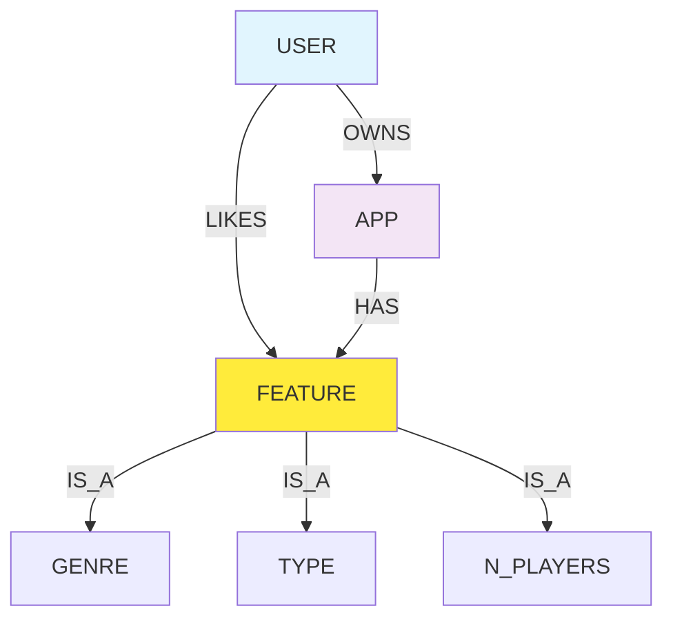
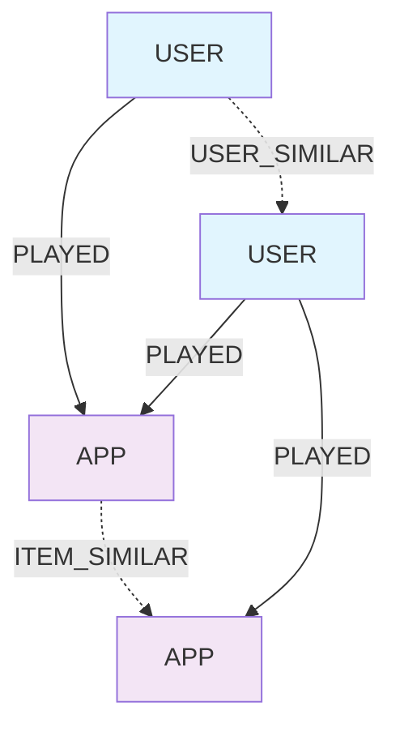

*Design patterns to make your Graph database serve as feature store, model store, and serving layer*

Building a recommender system on a graph database isn't just about modelling relationships—it's about designing a schema that scales, performs, and evolves with your algorithms. This deep dive explores how we designed Neo4j to power 15+ different recommendation approaches for Steam gaming data.

The key insight? Your graph schema becomes your feature store, similarity engine, and serving layer all in one. But only if you design it right.

## The Schema Design Challenge
Most graph database tutorials show you how to create nodes and relationships. Production recommender systems need to solve harder problems:

- **Multi-algorithm support**: Content-based, collaborative filtering, embeddings, and deep learning all need different graph patterns
- **Performance at scale**: 50M+ user-game interactions with sub-100ms query times
- **Feature engineering**: Converting raw properties into recommendation-ready features
- **Schema evolution**: Adding new node types and relationships without breaking existing algorithms

Our Steam recommender handles all of this through a layered schema design that separates core data from computed features.

## Core Schema: The Foundation Layer

The foundation layer models the essential Steam gaming entities and their natural relationships:

![[base_graph_schema.png]]

Users anchor the entire graph. Every recommendation algorithm traces paths from users to discover similarity patterns. We keep user nodes lean—just identifier, display name, and creation timestamp. Rich profile data gets modelled as separate connected nodes.

**Apps as Feature Aggregators**
```cypher
CREATE (a:APP {
    appid: 413150,
    title: "Stardew Valley",
    price: 14.99,
    required_age: 0,
    is_multiplayer: true
})
```

Games aggregate features from multiple dimensions. Rather than storing all metadata directly on APP nodes, we model features as separate nodes (GENRE, DEVELOPER, TYPE). This pattern enables flexible querying and algorithm-specific feature selection.

**Property-to-Node Expansion**

The most powerful design pattern: converting properties into nodes, more on it in [[#Schema Evolution Patterns]].

## Performance Layer: Constraints and Indexes

Graph databases perform through strategic constraints and indexes. Our schema uses five constraint patterns:

**Uniqueness Constraints**
```cypher
CREATE CONSTRAINT steamid IF NOT EXISTS
FOR (user:USER)
REQUIRE user.steamid IS UNIQUE;

CREATE CONSTRAINT appid IF NOT EXISTS  
FOR (app:APP)
REQUIRE app.appid IS UNIQUE;
```

Every entity type gets a uniqueness constraint on its primary identifier. This enables fast MERGE operations during data loading and prevents duplicate nodes.

**Composite Business Logic**
```cypher
CREATE CONSTRAINT genre IF NOT EXISTS
FOR (genre:GENRE) 
REQUIRE genre.genre IS UNIQUE;
```

Game-related entities like genres and developers use their natural names as unique identifiers. This simplifies data modeling and makes queries more readable.

**Query-Optimised Indexes**
Beyond uniqueness, we create indexes for common query patterns:

```cypher
-- Fulltext search on game titles
CREATE FULLTEXT INDEX app_title IF NOT EXISTS
FOR (n:APP) ON EACH [n.title]

-- Temporal queries on user activity
CREATE INDEX user_created_at IF NOT EXISTS
FOR (n:USER) ON (n.created_at)

-- Relationship properties for time-based filtering
CREATE INDEX friend_since_date IF NOT EXISTS
FOR ()-[n:FRIENDS]-() ON (n.friend_since)
```

The fulltext index enables "games like Cyberpunk" searches. The temporal indexes support user cohort analysis and friendship timeline queries.

## Algorithm-Specific Schema Extensions

The foundation layer handles core data. Algorithm layers add specialised patterns for different recommendation approaches.

### Content-Based Features Layer

Content-based filtering requires feature vectors. We model this through a FEATURE abstraction:



The pattern works through inheritance:

```cypher
-- Games connect to their natural features
MATCH (a:APP)-[:HAS_GENRE]->(g:GENRE)
MERGE (a)-[:FEATURE]->(g:Feature:GENRE)

-- Users inherit features from owned games  
MATCH (u:USER)-[:OWNS]->(a:APP)-[:FEATURE]->(f:Feature)
WITH u, f, count(a) as weight
MERGE (u)-[:LIKES {weight: weight}]->(f)
```

Now users and games exist in the same feature space. KNN similarity becomes a graph traversal rather than matrix math.

### Collaborative Filtering Similarities

Collaborative filtering creates computed similarity relationships:



The algorithm computes Jaccard similarity between users based on shared games, then writes similarity relationships:

```cypher
-- Compute item-item similarities
CALL gds.nodeSimilarity.write(
    'user_item_projection',
    {
        writeRelationshipType: 'ITEM_SIMILAR',
        similarityCutoff: 0.1,
        topK: 20
    }
)
```

These computed relationships become the graph's memory of similarity patterns.

### FastRP Embedding Properties

FastRP creates embedding vectors as node properties:

```cypher
-- Generate 128-dimensional embeddings
CALL gds.fastRP.mutate(
    'multi_entity_graph',
    {
        embeddingDimension: 128,
        mutateProperty: 'embedding'
    }
)
```

Now every node (users, games, groups, friends) has a 128-dimensional vector property. Cross-type recommendations become similarity queries in embedding space.

## Schema Evolution Patterns

Production schemas evolve. Our design supports non-breaking changes through three patterns:

**Additive Node Labels**

New algorithms add labels to existing nodes:

```cypher
-- Content-based filtering adds feature labels
MATCH (u:USER) WHERE exists(u.features)
SET u:USER_WITH_FEATURES

-- Embedding algorithms add vector labels  
MATCH (n) WHERE exists(n.embedding)
SET n:HAS_EMBEDDING
```

Existing queries continue working. New algorithms use specialised labels for performance.

**Relationship Type Expansion**

New relationship types augment the schema:

```cypher
-- Original relationships
(u:USER)-[:PLAYED]->(a:APP)

-- Algorithm-specific relationships
(u:USER)-[:SIMILAR_USER]->(u2:USER)
(a:APP)-[:SIMILAR_ITEM]->(a2:APP)
(u:USER)-[:FEATURE_SIMILAR]->(a:APP)
```

Each algorithm writes its own relationship types. This prevents conflicts and enables algorithm-specific optimisations.

**Property-to-Node Migration**

The most powerful evolution: converting properties to nodes without breaking existing code:

```cypher
-- Before: multiplayer as property
CREATE (a:APP {is_multiplayer: true})

-- After: multiplayer as connected node
CREATE (a:APP {is_multiplayer: true})
-[:IS_MULTIPLAYER]->(n:N_PLAYERS {is_multiplayer: true})
```

The property remains on the original node for backward compatibility. The new node enables relationship-based queries.

## Query Pattern Optimisation

Schema design is only as good as query performance. We optimise for three critical patterns:

### User Recommendation Queries

```cypher
-- Content-based recommendations
MATCH (u:USER {steamid: $userId})-[:LIKES]->(f:Feature)
MATCH (a:APP)-[:FEATURE]->(f)
WHERE NOT (u)-[:PLAYED]->(a)
RETURN a.title, count(f) as feature_overlap
ORDER BY feature_overlap DESC
LIMIT 10
```

**Optimisation**: The `USER_WITH_FEATURES` label restricts traversal to users with computed feature vectors, reducing query time from seconds to milliseconds.

### Similarity Discovery

```cypher  
-- Find similar games via collaborative filtering
MATCH (a:APP {appid: $gameId})-[:ITEM_SIMILAR]-(similar:APP)
RETURN similar.title, similar.appid
ORDER BY similar.similarity DESC
LIMIT 10
```

**Optimisation**: Pre-computed similarity relationships eliminate runtime computation. Queries become simple graph traversals.

### Cross-Type Recommendations

```cypher
-- FastRP cross-type recommendations  
MATCH (u:USER {steamid: $userId})
CALL gds.knn.stream('embedding_projection', {
    nodeProperty: 'embedding',
    topK: 10,
    concurrency: 1,
    sourceNode: u
})
YIELD node1, node2, similarity
WHERE labels(node2) = ['APP']
RETURN node2.title, similarity
```

**Optimisation**: The embedding projection includes only nodes with embedding properties, dramatically reducing search space.

## Memory and Storage Optimisation

At scale, schema design impacts memory and storage:

**Relationship Direction Strategy**

```cypher
-- Symmetric relationships (friendships)
(u1:USER)-[:FRIENDS]-(u2:USER)  // Undirected

-- Asymmetric relationships (ownership)  
(u:USER)-[:PLAYED]->(a:APP)     // Directed
```

Undirected relationships use less storage but require careful query planning. Directed relationships enable faster traversals in one direction.


**Batch Import Optimisation**

```cypher
-- Optimized for bulk loading
UNWIND $records as record
MERGE (u:USER {steamid: record.steamid})
MERGE (a:APP {appid: record.appid})  
MERGE (u)-[:PLAYED {playtime: record.playtime}]->(a)
```

UNWIND with MERGE operations enable transaction-efficient bulk loading while preventing duplicates.

## Real-World Performance Results

Our schema design delivers production performance across multiple recommendation algorithms:

**Query Performance**
- User recommendations: <50ms for 10 results
- Similarity lookups: <10ms for pre-computed relationships  
- Cross-type recommendations: <100ms using FastRP embeddings

**Storage Efficiency**
- 50M user-game relationships: 2.1GB Neo4j database
- 15 algorithm-specific relationship types: minimal storage overhead
- Feature vectors and embeddings: 500MB additional space

**Scalability Patterns**
- Read replicas for recommendation serving
- Write clusters for model training
- Projection-based algorithm isolation

## Schema Anti-Patterns to Avoid

**Over-Normalized Entity Modeling**

```cypher
-- Anti-pattern: Excessive normalization
(u:USER)-[:HAS_PROFILE]->(p:PROFILE)-[:HAS_NAME]->(n:NAME {value: "Alice"})

-- Better: Reasonable denormalization  
(u:USER {name: "Alice", profile_created: datetime()})
```

Graph databases aren't relational databases. Some denormalization improves performance.

**Algorithm-Agnostic Feature Storage**

```cypher
-- Anti-pattern: Generic features
(n)-[:HAS_FEATURE]->(f:FEATURE {name: "genre", value: "RPG"})

-- Better: Typed feature nodes
(n)-[:HAS_GENRE]->(g:GENRE {genre: "RPG"})
```

Strongly typed relationships enable algorithm-specific optimisations and clearer query patterns.

## The Future of Graph-Based Recommenders

Our schema design points toward emerging patterns in recommendation systems:

**Multi-Modal Integration**: Unified graphs supporting text, images, and behavioural data in single recommendation queries.

**Real-Time Learning**: Schema patterns that support online learning algorithms updating recommendations based on live user behaviour.

**Explainable AI**: Graph traversals that provide natural explanation paths for recommendations ("Because you liked RPGs and your friend Alice recommends it").

**Federated Recommendations**: Schema designs that enable recommendations across multiple platforms and data sources.

The graph database becomes more than storage—it becomes the computational substrate for next-generation recommendation algorithms.

## Conclusion: Schema as Strategy

In recommendation systems, schema design is strategic choice. Our Neo4j design enables:

- **Algorithm flexibility**: One schema supports 15+ different recommendation approaches
- **Performance scalability**: Sub-100ms queries across 50M+ relationships  
- **Feature evolution**: Non-breaking schema changes as algorithms evolve
- **Operational simplicity**: One database serves as feature store, model store, and serving layer

The key insight: design your schema for the algorithms you haven't built yet. The patterns that support today's content-based filtering will power tomorrow's graph neural networks.

Your schema is not just about storing data, but enabling algorithmic innovation at scale.