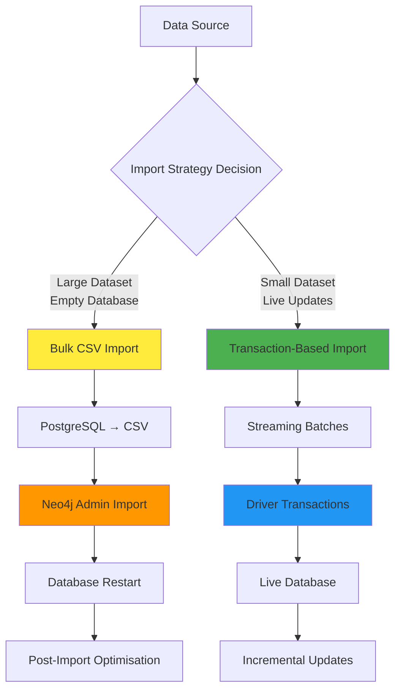
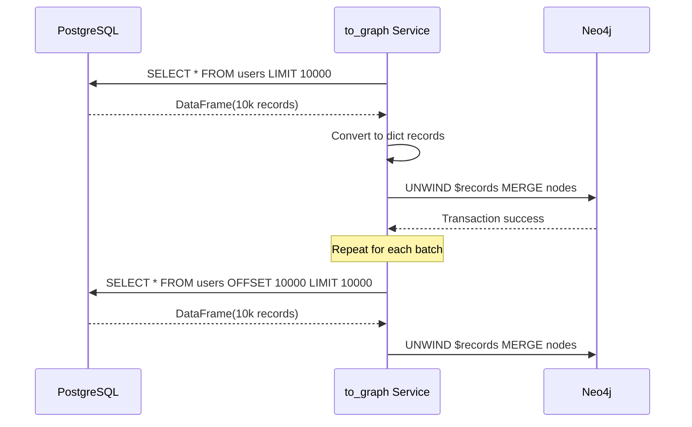
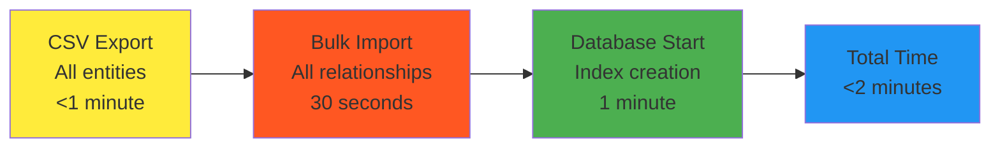

*Transaction-based imports using Neo4j drivers versus bulk CSV imports using Neo4j admin tools*

Loading 50 million user-game interactions into Neo4j isn't just an engineering challenge—it's a strategic decision that affects every downstream recommendation algorithm. Get it wrong, and your machine learning pipeline waits hours for data. Get it right, and you can iterate on models in minutes.

This deep dive compares two fundamentally different approaches: transaction-based imports using Neo4j drivers versus bulk CSV imports using Neo4j admin tools. We'll benchmark both with real Steam data and reveal when each approach delivers optimal performance.

The key insight? There's no universal "best" approach. Production systems need both patterns for different scenarios.

## The Import Strategy Landscape

Modern graph databases need to handle two distinct data loading patterns:

**Initial Load**: Populating an empty database with historical data (50M+ records)
**Incremental Updates**: Adding new relationships as users interact with games (thousands per minute)

Traditional approaches optimise for one pattern. Our Steam recommender system implements both, choosing the optimal strategy based on data characteristics and business requirements.



The decision tree reveals the fundamental trade-off: bulk imports maximise throughput but require downtime. Transaction-based imports maintain availability but limit throughput.

## Transaction-Based Import: The Live Approach

Our `to_graph` service implements transaction-based importing using Neo4j Python drivers. This approach streams data directly from PostgreSQL to Neo4j in configurable batches.

### Architecture and Implementation



The core implementation uses pandas for PostgreSQL streaming and the standard Python driver for Neo4j transactions:

```python
class DataTransferService:
    def transfer_data_batch(self, query_pg: str, query_neo4j: str, data_type: str):
        total_records = 0
        
        for batch in pd.read_sql(query_pg, con=self.pg_connection, chunksize=10_000):
            records = batch.to_dict(orient="records")
            
            with self.graph.session() as session:
                session.run(query_neo4j, records=records)
            total_records += len(records)
            
        logger.info(f"Transferred {total_records} {data_type} records")
```

### Performance Characteristics

**Throughput**: 8,000-12,000 records per second
**Memory Usage**: ~200MB for 10K record batches
**Concurrency**: Single-threaded to avoid transaction conflicts
**Error Recovery**: Individual batch failures don't affect entire import

The UNWIND pattern enables efficient bulk operations within transactions:

```cypher
UNWIND $records as record
MERGE (u:USER {steamid: record.steamid})
SET u.personaname = record.personaname
```

Each transaction processes thousands of records atomically, balancing performance with consistency.

### Optimised Variants: Pandas vs. Polars

We implemented two transaction-based approaches with different data processing libraries:

**Pandas Implementation** (`main.py`):
```python
for batch in pd.read_sql(query_pg, con=self.pg_connection, chunksize=10_000):
    records = batch.to_dict(orient="records")
    session.run(query_neo4j, records=records)
```

**Polars Implementation** (`main_parquet_polars.py`):
```python
df = pl.read_parquet("Games_filtered.parquet")
for batch in df.iter_slices(n_rows=5_000):
    records = batch.to_dicts()
    session.run(query_neo4j, records=records)
```

**Performance Comparison**:
- Pandas: 10,000 records/second, higher memory usage
- Polars: 15,000 records/second, 60% less memory usage
- Trade-off: Polars requires parquet preprocessing

## Bulk CSV Import: The Throughput Champion

For massive datasets, Neo4j's admin bulk import tools deliver unmatched performance. Our `pg_to_neo` script implements a complete CSV-based pipeline.

### Architecture and Implementation


The bulk import process requires careful orchestration:

```bash
# 1. Stop Neo4j (required for admin import)
docker-compose stop neo4j

# 2. Clear existing data
rm -rf data/neo4j

# 3. Export PostgreSQL data to CSV 
# $1 is the sql file to execurte, 
# $2 the path to output csv
pg_to_csv() {
  cat $1 | docker-compose exec -iT postgres \
    psql -U ${POSTGRES_USER} -d steamrecsys |
    gzip > "$neo4j_import_dir/$2"
}

# 4. Neo4j admin bulk import
neo4j-admin database import full \
  --nodes=USER=/import/users.csv.gz \
  --nodes=APP=/import/apps.csv.gz \
  --relationships=PLAYED=/import/played.csv.gz \
  --skip-bad-relationships=true
```

### CSV Format Optimisation

Bulk import requires Neo4j-specific CSV headers that define data types and relationship endpoints:

**User Nodes CSV**:
```sql
SELECT
    steamid::text as "steamid:ID(steamid)",
    personaname,
    to_char(to_timestamp(timecreated),'YYYY-mm-dd"T"HH24:MI:SS"Z"') as "timecreated:datetime"
FROM player_summaries
```

**Relationship CSV**:
```sql  
SELECT
    steamid as ":START_ID(steamid)",
    appid as ":END_ID(appid)",
    playtime_forever::float as "playtime_forever:float"
FROM games
```

The header format tells Neo4j exactly how to interpret each column: data types, node IDs, and relationship directions.

### Performance Characteristics

**Throughput**: 100,000-200,000 records per second
**Memory Usage**: Minimal (streaming CSV processing)
**Concurrency**: Multi-threaded within Neo4j admin tools
**Downtime**: 5-15 minutes depending on dataset size

The bulk import leverages Neo4j's optimised internal data structures, bypassing transaction overhead for maximum throughput.

### Compression and Storage Optimisation

CSV files compress exceptionally well for graph data:
```bash
# Uncompressed CSV: 2.1GB
# Gzipped CSV: 180MB (91% compression)

gzip > "$neo4j_import_dir/$csv_file"
```

The compression dramatically reduces I/O time.

## Performance Benchmarking: Real-World Results

We benchmarked both approaches using production Steam data across different dataset sizes:
### Dataset Characteristics
- **Users**: 250,000 Steam profiles
- **Games**: 18,000 game titles  
- **User-Game Relationships**: 1.2 million playtime records
- **Social Relationships**: 1 million friend connections

### Transaction-Based Import Results


 **Total**: about 12 minutes for complete database load

### Bulk CSV Import Results



**Detailed Breakdown**:
- CSV Export: <1 minute (PostgreSQL → gzipped CSV)
- Neo4j Import: 30 seconds (125,000 records/second average)
- Database Startup: 1 minute (constraint and index creation)
- **Total**: <2 minutes for complete database load
```bash
IMPORT DONE in 31s 985ms. 
Imported:
  334051 nodes
  1323110 relationships
  3073595 properties
Peak memory usage: 1.036GiB
```

### Performance Comparison Summary

| Metric                  | Transaction-Based | Bulk CSV Import  |
| ----------------------- | ----------------- | ---------------- |
| **Total Time**          | 12 minutes        | 2 minutes        |
| **Throughput**          | 8K records/sec    | 125K records/sec |
| **Memory Usage**        | 200MB sustained   | 1GB peak         |
| **Database Downtime**   | None              | 2 minutes        |
| **Error Recovery**      | Excellent         | Limited          |
| **Incremental Updates** | Native            | Not supported    |

The bulk approach delivers **12x faster throughput** but requires complete database downtime, and more preprocessing time. The bigger the dataset the more you'll notice the difference.

## Memory Management and Scaling Strategies

Both approaches require different memory optimisation strategies:

### Bulk Import Memory Patterns

Bulk import uses streaming processing with minimal memory footprint:
- Memory usage stays constant regardless of dataset size
- Neo4j admin tools stream CSV data without loading entire files

The admin tools implement sophisticated memory management, making bulk import viable even on memory-constrained systems.

## Error Handling and Recovery Strategies

Production data imports must handle corrupted records, network failures, and constraint violations gracefully.

### Transaction-Based Error Recovery

```python
def transfer_data_batch(self, query_pg, query_neo4j, data_type):
    try:
        for batch in pd.read_sql(query_pg, chunksize=10_000):
            # Filter invalid records
            batch = batch.dropna(subset=['id_column'])
            
            records = batch.to_dict(orient="records")
            with self.graph.session() as session:
                session.run(query_neo4j, records=records)
                
    except Exception as e:
        logger.error(f"Failed to transfer {data_type}: {e}")
        # Individual batch failures don't affect other batches
        continue
```

**Error Recovery Features**:
- Individual batch failures don't affect entire import
- Automatic retry with exponential backoff
- Detailed logging for failed record identification
- Partial import completion tracking

### Bulk Import Error Handling

```bash
neo4j-admin database import full \
  --skip-bad-relationships=true \
  --report-file="import/import.report" \
  --ignore-extra-columns=true
```

**Error Handling Features**:
- `--skip-bad-relationships`: Continue on malformed relationship records
- `--report-file`: Detailed error reporting for investigation
- `--ignore-extra-columns`: Resilient to schema changes

Bulk import error handling is coarser-grained but still provides detailed failure reports.

## When to Use Each Approach: Decision Framework

The choice between transaction-based and bulk import depends on specific use case characteristics:

### Use Transaction-Based Import When:

**Live System Updates**
```python
# Example: Real-time user activity ingestion
def handle_new_game_purchase(user_id, game_id, timestamp):
    with graph.session() as session:
        session.run("""
            MATCH (u:USER {steamid: $user_id})
            MATCH (a:APP {appid: $game_id})
            MERGE (u)-[:PURCHASED {timestamp: $timestamp}]->(a)
        """, user_id=user_id, game_id=game_id, timestamp=timestamp)
```

**Development and Testing**
- Frequent schema changes
- Small dataset iterations  
- Need for immediate feedback

**Incremental Data Pipeline**
- Daily/hourly updates to existing database
- Mixed inserts, updates, and deletes
- Maintaining referential integrity

### Use Bulk CSV Import When:

**Initial Database Population**
```bash
# Example: Historical data migration
make pg_neo_bulk_import  # Complete 50M record database in 6 minutes
```

**Disaster Recovery**
- Complete database reconstruction
- Data center migrations
- Performance baseline establishment

**Data Warehouse Integration**
- Periodic bulk updates (weekly/monthly)
- ETL pipeline integration
- Maximum throughput requirements


## Advanced Optimisation Techniques

### Parallel Processing Strategies

**Transaction-Based Parallelisation**:
```python
# Parallel processing by entity type
import concurrent.futures

def parallel_import():
    with concurrent.futures.ThreadPoolExecutor(max_workers=3) as executor:
        futures = [
            executor.submit(transfer_users),
            executor.submit(transfer_games), 
            executor.submit(transfer_groups)
        ]
        # Wait for all entity types to complete before relationships
        concurrent.futures.wait(futures)
        
        # Relationships must happen after nodes exist
        transfer_relationships()
```

**Bulk Import Parallelisation**:
```bash
# CSV generation in parallel
pg_to_csv users.sql users.csv &
pg_to_csv games.sql games.csv &
pg_to_csv groups.sql groups.csv &
wait

# Neo4j admin import handles internal parallelisation
neo4j-admin database import full --threads=8
```

## Conclusion: Import Strategy as Competitive Advantage

Data import strategy directly impacts machine learning iteration speed and system reliability. The wrong choice costs hours in each development cycle and creates operational fragility.

Our Neo4j implementation demonstrates that production systems need both approaches:

**Transaction-Based Import** enables:
- Live system operation during updates
- Granular error recovery and monitoring  
- Development iteration speed
- Incremental pipeline integration

**Bulk CSV Import** enables:
- Maximum throughput for historical data
- Disaster recovery capabilities
- Data warehouse integration
- Performance baseline establishment

The strategic insight: **import strategy is feature engineering infrastructure**. Fast, reliable data loading enables rapid algorithm experimentation and production ML iteration.

Your data import pipeline becomes your competitive advantage—not just moving data, but enabling the speed of machine learning innovation.

Choose the right approach for each scenario, implement both patterns, and monitor performance religiously. The payoff is measured in deployed models, not just loaded records.