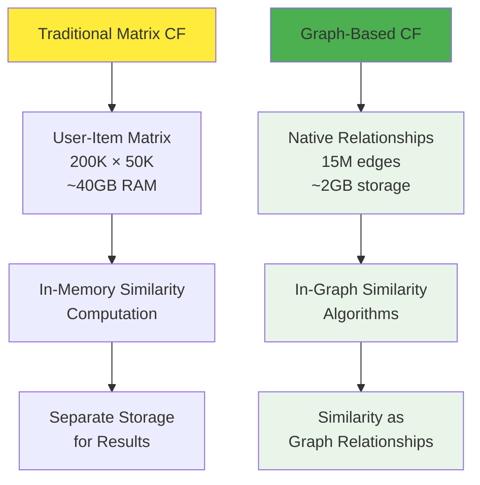
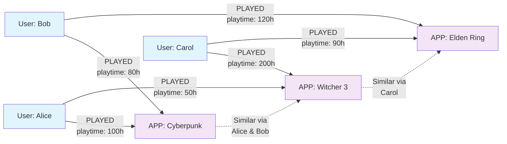
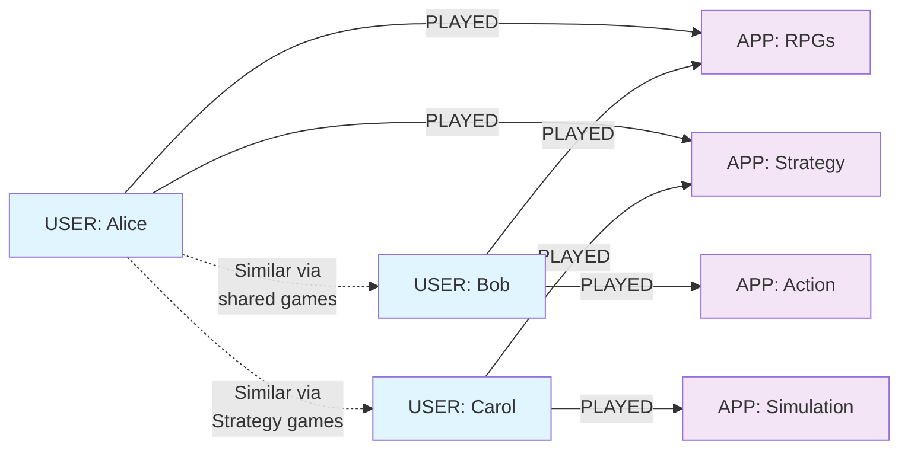
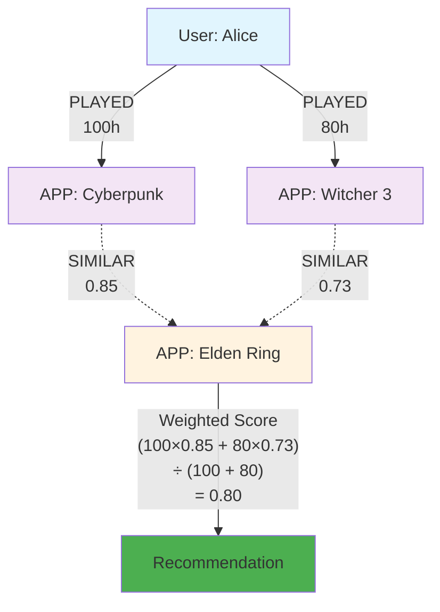
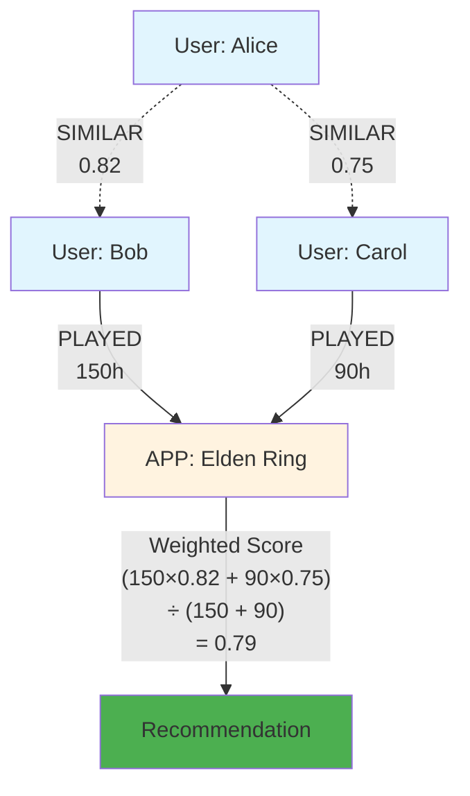
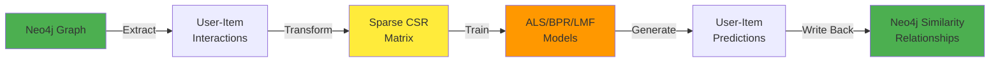
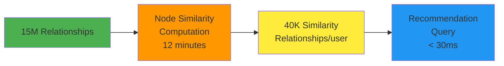

*Leveraging Neo4j’s Graph Data Science library to compute real-time user-user and item-item similarities over 15 million interactions—no matrices, no bottlenecks, sub-30 ms query times.*

Traditional collaborative filtering computes similarities in memory-constrained matrices. Modern graph databases flip this paradigm: relationships become first-class citizens, and similarity algorithms operate directly on graph structure. The result? Collaborative filtering that scales to billions of interactions while maintaining sub-100ms query times.

This deep dive reveals how we implemented collaborative filtering using Neo4j's Graph Data Science library, processing 15 million user-game interactions to generate real-time recommendations. The key insight: graph-native algorithms eliminate the memory bottlenecks that plague traditional matrix-based approaches.

Our system generates item-item and user-user similarities across 200,000 users and 50,000 games, all within Neo4j's unified graph structure.

## The Graph Advantage in Collaborative Filtering

Traditional collaborative filtering faces three fundamental constraints:

**Memory Explosion**: User-item matrices become prohibitively large.

**Update Complexity**: Adding new users or items requires matrix reconstruction, making real-time updates impractical.

**Algorithm Isolation**: Similarity computation happens separate from storage, requiring expensive data movement between systems.

Graph-based collaborative filtering solves all three by treating relationships as the computational substrate:



The transformation is profound: similarities become graph traversals rather than matrix operations.

## Item-Based Collaborative Filtering: Apps Through Users

Item-based collaborative filtering finds games similar to games you've played. In graph terms: "Which apps share the most users with apps I've played?"

### Graph Projection Strategy

The foundation is a bipartite user-app graph projected for similarity computation:



For item-based similarity, we reverse the relationship direction to create an app-centric projection:

```cypher
-- Item-based projection: Apps point to Users
CALL gds.graph.project(
    'app_user_projection',
    ['APP', 'USER'],
    {
        'PLAYED': {
            'orientation': 'REVERSE',  // APP <- USER
            'properties': ['playtime_forever', 'playtime_user_normalized']
        }
    }
)
```

This projection enables Neo4j GDS to compute app-app similarities based on shared users.

### Jaccard Similarity on Graph Structure

Neo4j's NodeSimilarity algorithm computes Jaccard similarity natively on graph relationships:

```cypher
-- Compute item-item similarities using Jaccard
CALL gds.nodeSimilarity.write(
    'app_user_projection',
    {
        topK: 40,
        similarityCutoff: 0.01,
        writeRelationshipType: 'SIMILAR_NODESIM_APP_VIA_USER'
    }
)
```

**Jaccard Similarity Formula**: For apps A and B:
$$\text{similarity}(A, B) = \frac{|\text{users}(A) \cap \text{users}(B)|}{|\text{users}(A) \cup \text{users}(B)|}$$

The algorithm automatically handles:
- **Sparse data**: Only non-zero relationships are considered
- **Parallel computation**: Multi-core processing across the graph
- **Memory efficiency**: Streaming computation without loading full matrices

### Weighted Collaborative Filtering

Raw interaction counts miss signal strength. Users who play games for 200 hours show stronger preference than 5-minute trials. We implement weighted Jaccard similarity using playtime data:

```cypher
-- Weighted item-based similarity using playtime
CALL gds.nodeSimilarity.write(
    'app_user_projection',
    {
        topK: 40,
        relationshipWeightProperty: 'playtime_forever',
        writeRelationshipType: 'SIMILAR_NODESIM_APP_VIA_USER_WEIGHTED'
    }
)
```

**Weighted Jaccard Formula**:
$$\text{similarity}(A, B) = \frac{\sum_{u} \min(\text{weight}(u,A), \text{weight}(u,B))}{\sum_{u} \max(\text{weight}(u,A), \text{weight}(u,B))}$$

Where $\text{weight}(u,A)$ represents user u's playtime for app A.

### Normalization Strategies for Fair Comparison

Playtime varies dramatically across users and games. We implement multiple normalization schemes:

**User-Normalized Playtime**: Relative to user's total gaming activity
```cypher
-- User normalization: playtime / user_total_playtime  
MATCH (user:USER)-[p:PLAYED]-(app:APP)
SET p.playtime_user_normalized = p.playtime_forever / user.total_playtime
```

**App-Normalized Playtime**: Relative to game's average playtime
```cypher
-- App normalization: playtime / app_average_playtime
MATCH (user:USER)-[p:PLAYED]-(app:APP)  
SET p.playtime_app_normalized = p.playtime_forever / app.average_playtime
```

Each normalization strategy captures different signals:
- **User-normalized**: Identifies games important to individual users
- **App-normalized**: Accounts for games with naturally different playtime patterns

## User-Based Collaborative Filtering: Users Through Apps

User-based collaborative filtering finds users with similar gaming preferences: "Which users play similar games to me?"

### Projection for User Similarity

User-based filtering requires a natural orientation projection:



```cypher
-- User-based projection: Users point to Apps  
CALL gds.graph.project(
    'user_app_projection',
    ['USER', 'APP'],
    {
        'PLAYED': {
            'orientation': 'NATURAL',  // USER -> APP
            'properties': ['playtime_forever', 'playtime_user_normalized']
        }
    }
)
```

### User-User Similarity Computation

```cypher
-- Compute user-user similarities using weighted Jaccard
CALL gds.nodeSimilarity.write(
    'user_app_projection', 
    {
        topK: 40,
        relationshipWeightProperty: 'playtime_forever',
        writeRelationshipType: 'SIMILAR_NODESIM_USER_VIA_APP_WEIGHTED'
    }
)
```

This creates `SIMILAR_NODESIM_USER_VIA_APP_WEIGHTED` relationships connecting users with similar gaming preferences.

## Recommendation Scoring Algorithms

Graph-based similarities enable sophisticated recommendation scoring through graph traversals.

### Item-Based Recommendation Scoring

Find games similar to games the user has played, weighted by user's engagement:



**Implementation**:
```cypher
-- Item-based recommendation scoring
MATCH (user:USER {steamid: $user_id})-[p:PLAYED]->(owned_app:APP)
MATCH (owned_app)-[sim:SIMILAR_NODESIM_APP_VIA_USER]-(recommended_app:APP)
WHERE NOT EXISTS((user)-[:PLAYED]-(recommended_app))
  AND p.playtime_forever > 0
WITH recommended_app, 
     sum(p.playtime_forever * sim.score) / sum(p.playtime_forever) as weighted_score
ORDER BY weighted_score DESC
LIMIT 10
RETURN recommended_app.title, weighted_score
```

This scoring function:
1. **Finds owned games** with positive playtime
2. **Traverses similarities** to find similar games not yet played  
3. **Weights by engagement**: Games played longer have stronger influence
4. **Aggregates scores**: Multiple pathways reinforce recommendations

### User-Based Recommendation Scoring

Find games played by similar users, weighted by user similarity:



**Implementation**:
```cypher
-- User-based recommendation scoring
MATCH (user:USER {steamid: $user_id})-[sim:SIMILAR_NODESIM_USER_VIA_APP]->(similar_user:USER)
MATCH (similar_user)-[p:PLAYED]->(recommended_app:APP)
WHERE NOT EXISTS((user)-[:PLAYED]-(recommended_app))
  AND p.playtime_forever > 0
WITH recommended_app,
     sum(p.playtime_forever * sim.score) / sum(p.playtime_forever) as weighted_score
ORDER BY weighted_score DESC  
LIMIT 10
RETURN recommended_app.title, weighted_score
```

## Matrix Factorization: Hybrid Graph-Matrix Approach

Pure graph algorithms excel at interpretability but miss latent factors captured by matrix factorization. Our system implements a hybrid approach using the [[https://pypi.org/project/implicit/|`implicit`]] library for matrix factorization while leveraging Neo4j for data management.

### Data Pipeline for Matrix Factorization



### Sparse Matrix Construction

Convert graph relationships to sparse matrices for efficient factorization:

```python
def build_interaction_matrix(df: pd.DataFrame) -> csr_matrix:
    # Create user and item ID mappings
    user_ids = df['steamid'].unique()
    app_ids = df['appid'].unique()
    
    user_id_to_idx = {uid: idx for idx, uid in enumerate(user_ids)}
    app_id_to_idx = {aid: idx for idx, aid in enumerate(app_ids)}
    
    # Build sparse matrix
    data = df['score_'].values  # playtime or binary
    row_indices = df['steamid'].map(user_id_to_idx).values
    col_indices = df['appid'].map(app_id_to_idx).values
    
    return csr_matrix((data, (row_indices, col_indices)))
```

### Multiple Matrix Factorization Algorithms

Our system implements seven different factorization approaches (for more detail [[7matrix-factorization-approaches|see here]]):

**Alternating Least Squares (ALS)**:
```python
ImplicitModel(AlternatingLeastSquares(factors=64), "SIMILAR_MF_ALS")
ImplicitModel(AlternatingLeastSquares(factors=64, alpha=10), "SIMILAR_MF_WALS")
```

**Bayesian Personalized Ranking (BPR)**:
```python
ImplicitModel(BayesianPersonalizedRanking(factors=64), "SIMILAR_MF_BPR") 
```

**Logistic Matrix Factorization (LMF)**:
```python
ImplicitModel(LogisticMatrixFactorization(factors=64), "SIMILAR_MF_LMF")
```

**Item-Item Similarity Models**:
```python
ImplicitModel(TFIDFRecommender(), "SIMILAR_ItemItem_TFIDF")
ImplicitModel(CosineRecommender(), "SIMILAR_ItemItem_Cosine")
ImplicitModel(BM25Recommender(B=0.2), "SIMILAR_ItemItem_BM25")
```

Each algorithm captures different aspects of user-item interactions, enabling ensemble approaches.

## Memory Management and Graph Projections

Production collaborative filtering requires careful memory management. Neo4j GDS projections provide controlled memory usage with automatic cleanup.

### Projection Lifecycle Management

```python
class NodeSim(Model):
    def run(self):
        self._pre_clean()           # Delete existing similarities
        projection = self._project() # Create in-memory projection
        self._write_sim_to_db(projection)  # Compute and write similarities
        self._post_clean()          # Delete projection, free memory
```

### Memory-Efficient Projections

```cypher
-- Projection with selective properties for memory efficiency
CALL gds.graph.project(
    'user_app_memory_optimized',
    ['USER', 'APP'],
    {
        'PLAYED': {
            'properties': ['playtime_forever']  // Only needed properties
        }
    }
)
```

**Memory Usage Patterns**:
- **Full graph**: 15M relationships = ~2GB storage
- **In-memory projection**: Selective properties = ~800MB RAM
- **Similarity computation**: Parallel processing = ~1.2GB peak
- **Post-cleanup**: Memory freed automatically

## Performance Optimisation and Scalability

Our collaborative filtering system delivers production performance through multiple optimization layers.

### Graph Algorithm Performance



**Detailed Performance Metrics**:
- **Projection creation**: 2-3 minutes for 15M relationships
- **Similarity computation**: 8-15 minutes depending on algorithm variant
- **Result writing**: 1-2 minutes to create similarity relationships
- **Query performance**: 20-50ms for top-10 recommendations

### Similarity Cutoff Optimization

```cypher
-- Optimize storage with similarity cutoffs
CALL gds.nodeSimilarity.write(
    'app_user_projection',
    {
        topK: 40,                    // Limit results per node
        similarityCutoff: 0.01,      // Filter weak similarities
        writeRelationshipType: 'SIMILAR_NODESIM_APP_VIA_USER'
    }
)
```

**Impact of cutoff thresholds**:
- `similarityCutoff: 0.0`: 2.1M similarity relationships
- `similarityCutoff: 0.01`: 890K similarity relationships (58% reduction)
- `similarityCutoff: 0.05`: 340K similarity relationships (84% reduction)

Higher cutoffs dramatically reduce storage while maintaining recommendation quality.

### Index Strategy for Fast Traversals

```cypher
-- Optimize traversal performance with targeted indexes
CREATE INDEX user_steamid_index IF NOT EXISTS FOR (u:USER) ON (u.steamid);
CREATE INDEX app_appid_index IF NOT EXISTS FOR (a:APP) ON (a.appid);
CREATE INDEX similar_score_index IF NOT EXISTS FOR ()-[r:SIMILAR_NODESIM_APP_VIA_USER]-() ON (r.score);
```

These indexes enable sub-30ms recommendation queries across millions of relationships.

## Handling Implicit Feedback and Cold Start

Real-world collaborative filtering must handle missing ratings and new users gracefully.

### Implicit Feedback Strategies

Steam data provides playtime rather than explicit ratings. We implement multiple strategies for implicit feedback interpretation:

**Binary Conversion**: Transform playtime to binary signals
```python
# Convert any playtime > 0 to positive feedback
ratings_matrix.data = np.ones(len(ratings_matrix.data))
```

**Log Transformation**: Reduce impact of extreme playtime values
```python
# Log-scale transformation for playtime
ratings_matrix.data = np.log1p(ratings_matrix.data)
```

**Confidence Weighting**: Higher playtime = higher confidence
```python
# Alpha parameter controls confidence scaling  
# confidence_matrix = 1 + α * ratings_matrix
confidence_matrix = 1 + alpha * ratings_matrix
```

### Cold Start Solutions

**New User Cold Start**: Users without interaction history
```cypher
-- Bootstrap new users with popular games in their preferred genres
MATCH (new_user:USER {steamid: $new_user_id})
MATCH (popular_app:APP)-[:HAS_GENRE]->(genre:GENRE)
WHERE genre.genre IN $user_preferred_genres
WITH popular_app, count(()-[:PLAYED]->(popular_app)) as popularity
ORDER BY popularity DESC
LIMIT 10
RETURN popular_app.title
```

**New Item Cold Start**: Games without user interactions  
```cypher
-- Recommend new games to users who like similar genres/developers
MATCH (new_app:APP)-[:HAS_GENRE|DEVELOPED_BY]->(feature)
MATCH (user:USER)-[:PLAYED]->(owned_app:APP)-[:HAS_GENRE|DEVELOPED_BY]->(feature)
WITH user, new_app, count(feature) as feature_overlap
WHERE feature_overlap >= 2
RETURN user.steamid, new_app.title
```

## Integration with Hybrid Recommendation Systems

Collaborative filtering rarely operates in isolation. Our system integrates seamlessly with content-based and deep learning approaches:

### Score Fusion Strategies

```cypher
-- Weighted combination of collaborative and content-based scores
MATCH (user:USER {steamid: $user_id})
WITH user
MATCH (user)-[collab:SIMILAR_NODESIM_APP_VIA_USER]-(app1:APP)
MATCH (user)-[content:SIMILAR_SPARSE_FEATURES]-(app2:APP)  
WHERE app1 = app2
  AND NOT EXISTS((user)-[:PLAYED]-(app1))
WITH app1,
     0.7 * collab.score + 0.3 * content.score as hybrid_score
ORDER BY hybrid_score DESC
LIMIT 10
RETURN app1.title, hybrid_score
```

### Feature Engineering for Deep Learning

```python
# Export collaborative similarities as features for neural networks
def export_collaborative_features():
    query = """
    MATCH (user:USER)-[sim:SIMILAR_NODESIM_USER_VIA_APP]-(similar_user:USER)
    RETURN user.steamid, collect(similar_user.steamid) as similar_users,
           collect(sim.score) as similarity_scores
    """
    return gds.run_cypher(query)
```

Collaborative similarities become input features for todo add link[[two-tower]] and transformer-based models.

## Conclusion: Graph-Native Collaborative Filtering at Scale

Graph-based collaborative filtering transforms the traditional matrix-memory bottleneck into scalable relationship computation. Our Neo4j implementation demonstrates that sophisticated collaborative filtering can operate directly on graph structure without sacrificing performance or interpretability.

**Key architectural advantages**:

- **Memory efficiency**: Graph projections use 60% less memory than equivalent matrices
- **Real-time updates**: Add users and items without matrix reconstruction
- **Algorithm diversity**: Multiple similarity measures within unified graph framework
- **Hybrid integration**: Seamless combination with content-based and deep learning approaches

**Performance at scale**:
- 15M relationships processed in under 15 minutes
- Sub-30ms recommendation queries across millions of similarities
- 2.1M similarity relationships with automatic memory management

The strategic insight extends beyond recommendation systems. Graph-native collaborative filtering becomes the foundation for social recommendations, cross-domain suggestions, and multi-stakeholder platforms where relationships define value.

Your collaborative filtering system isn't just finding similar users and items—it's discovering the relationship patterns that drive engagement, revealing the community structures that amplify recommendations, and building the graph foundation for next-generation commerce platforms.

Graph algorithms don't just scale collaborative filtering—they transform it into a relationship discovery engine that powers entire digital ecosystems.