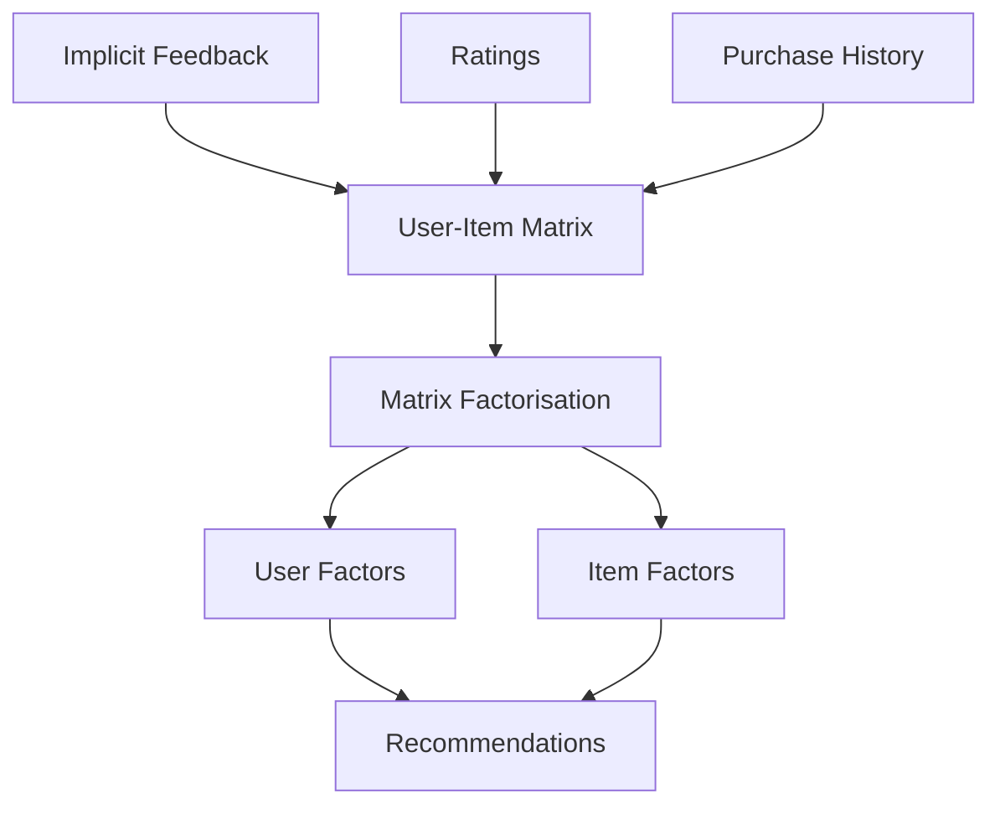
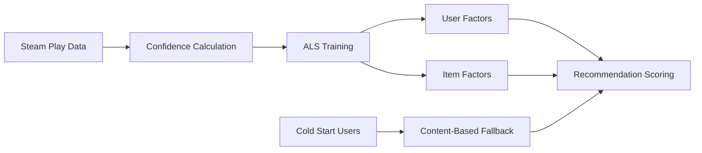
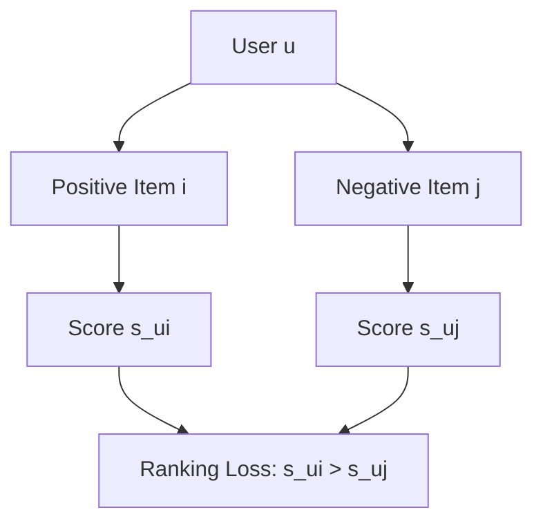
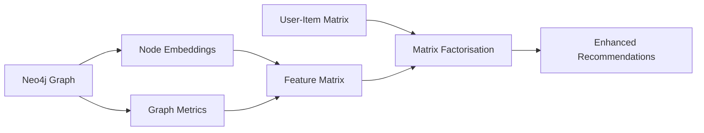
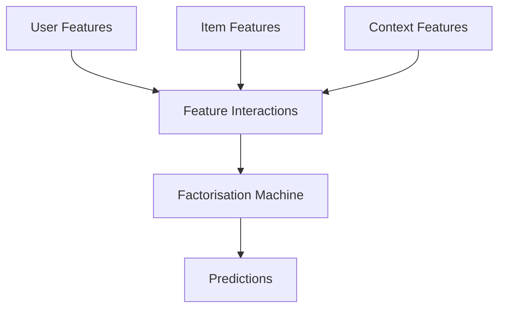

*When millions of interactions hide billion-dollar insights*

In our journey through recommendation system architectures, we've explored graph-based approaches and embeddings. Now we turn to one of the foundational pillars of collaborative filtering: **matrix factorisation**. This article examines how classical techniques like Alternating Least Squares (ALS) and Bayesian Personalised Ranking (BPR) integrate with modern graph-based features to create robust recommendation engines.

## The Matrix Factorisation Landscape

Matrix factorisation decomposes the user-item interaction matrix into lower-dimensional latent factors, revealing hidden patterns in user preferences and item characteristics. Unlike graph algorithms that work with explicit relationships, matrix factorisation excels at capturing implicit patterns in sparse interaction data.



The Steam dataset presents unique challenges: games have rich metadata (genres, developers, price), users exhibit complex preference patterns, and most interactions are implicit (play time, achievements) rather than explicit ratings.

## ALS: The Workhorse of Implicit Feedback

Alternating Least Squares addresses the fundamental challenge of recommender systems: learning from implicit feedback where we observe positive interactions but lack explicit negative signals.

### Mathematical Foundation

For implicit feedback, we reformulate the problem using confidence weights:

$$\min \sum_{u,i} c_{ui}(p_{ui} - \mathbf{x}_u^T \mathbf{y}_i)^2 + \lambda\left(\sum_u ||\mathbf{x}_u||^2 + \sum_i ||\mathbf{y}_i||^2\right)$$

Where:
- $c_{ui}$ represents confidence in the interaction
- $p_{ui}$ indicates preference (1 for interaction, 0 otherwise)
- $\mathbf{x}_u$ and $\mathbf{y}_i$ are user and item latent factors

### Implementation Architecture



The key insight for Steam data lies in confidence calculation. Play time naturally provides implicit feedback strength:

```python
def calculate_confidence(play_time_minutes):
    """Convert play time to confidence weights"""
    # Log transformation to handle extreme values
    base_confidence = 1.0
    time_factor = min(np.log(1 + play_time_minutes / 60), 10.0)
    return base_confidence + time_factor
```

### Weighted vs. Unweighted Variants

**Unweighted ALS** treats all interactions equally, suitable when interaction presence is more important than magnitude. For Steam, this works well for discovery-focused recommendations.

**Weighted ALS** incorporates confidence scores, perfect for engagement-focused recommendations where play time indicates preference strength.

```python
# Weighted variant implementation pattern
from implicit import AlternatingLeastSquares

model = AlternatingLeastSquares(
    factors=64,
    regularization=0.01,
    iterations=20,
    use_native=True,
    random_state=42
)

# Transform play time to confidence matrix
confidence_matrix = sparse_interaction_matrix.copy()
confidence_matrix.data = np.log(1 + confidence_matrix.data)

model.fit(confidence_matrix)
```

## BPR: Learning to Rank with Implicit Feedback

Bayesian Personalised Ranking reframes recommendation as a ranking problem, directly optimising for the relative ordering of items rather than absolute preference scores.

### The Ranking Paradigm

BPR's core assumption: users prefer items they've interacted with over those they haven't. This creates training triplets `(user, positive_item, negative_item)` where the model learns to rank the positive item higher.



### Training Dynamics

The BPR objective function:
$$\max \sum_{(u,i,j) \in D_S} \ln \sigma(\hat{x}_{uij}) - \lambda ||\Theta||^2$$

where $\hat{x}_{uij} = \hat{x}_{ui} - \hat{x}_{uj}$ (preference difference)

The regularisation term $\lambda ||\Theta||^2$ prevents overfitting by penalising large parameter values, where $\Theta$ represents all model parameters (user and item factors) and $\lambda$ controls the strength of regularisation.

This formulation naturally handles the implicit feedback challenge by learning relative preferences rather than absolute ratings.

### Negative Sampling Strategies

Effective negative sampling is crucial for BPR performance:

```python
def sample_negatives(user_items, n_items, n_negatives=5):
    """Sample negative items for BPR training"""
    positives = set(user_items)
    negatives = []
    
    while len(negatives) < n_negatives:
        candidate = np.random.randint(0, n_items)
        if candidate not in positives:
            negatives.append(candidate)
    
    return negatives
```

**Uniform sampling** provides unbiased estimates but can be inefficient with popular items.

**Popularity-based sampling** focuses learning on distinguishing preferences among popular items.

## Integration with Graph-Based Features

The true power of matrix factorisation emerges when combined with graph-derived features from our Neo4j architecture.

### Feature Augmentation Pipeline



### Cold Start Integration

Graph features provide elegant solutions for cold start problems:

```python
def handle_cold_start(user_id, graph_features, mf_model):
    """Combine graph and matrix factorisation for new users"""
    if user_id in mf_model.user_factors:
        # Warm user: use matrix factorisation
        return mf_model.recommend(user_id)
    else:
        # Cold user: use graph-based similarity
        similar_users = find_similar_users_by_graph(
            user_id, graph_features
        )
        return aggregate_recommendations(similar_users)
```

## Advanced Variants and Extensions

### Linear Matrix Factorisation (LMF)

LMF extends basic matrix factorisation with linear bias terms, capturing global effects:

$$r_{ui} = \mu + b_u + b_i + \mathbf{x}_u^T \mathbf{y}_i$$

This formulation naturally handles popularity bias and user rating tendencies.

### Factorisation Machines

For incorporating rich side information, Factorisation Machines extend matrix factorisation to arbitrary feature interactions:



## Looking Forward

Matrix factorisation remains relevant in the era of deep learning, often serving as:

- **Strong baselines** for model comparison
- **Feature extractors** for downstream models
- **Hybrid components** in ensemble systems
- **Interpretable alternatives** when explainability matters

In our [[8deep-learning-recommendations|next article]], we'll explore how deep learning approaches like Two-Tower architectures and Neural Collaborative Filtering build upon these matrix factorisation foundations while addressing their limitations.

The integration of classical matrix factorisation with modern graph databases demonstrates how foundational algorithms remain valuable when thoughtfully combined with contemporary infrastructure. The Steam recommender system showcases this integration, using Neo4j for feature engineering and relationship discovery while leveraging matrix factorisation for scalable collaborative filtering.