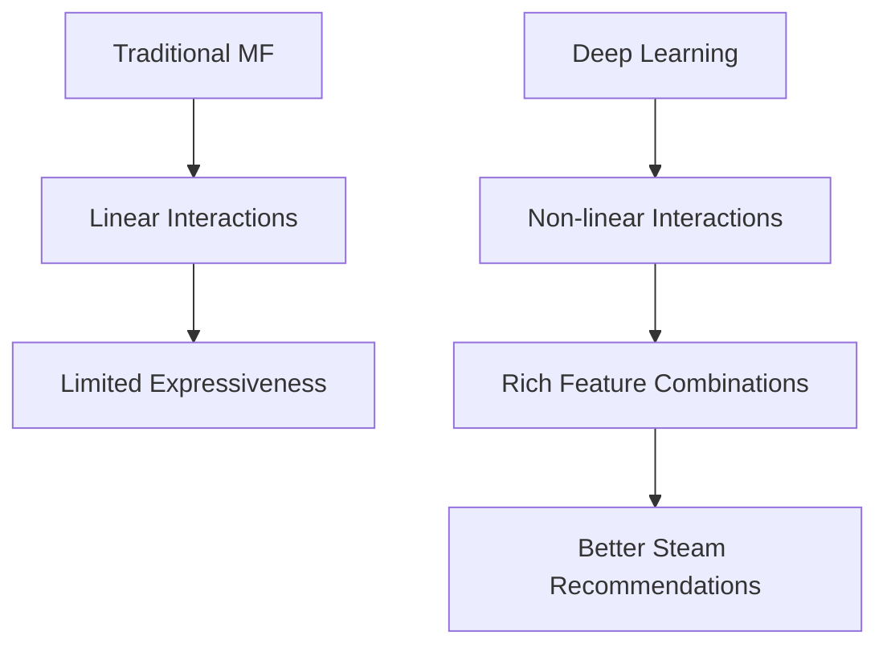
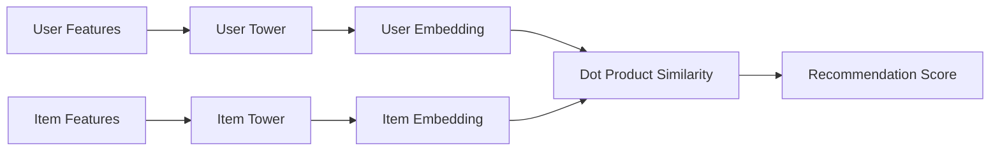
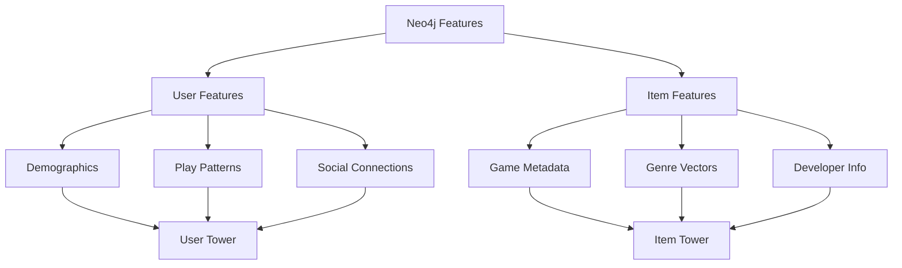
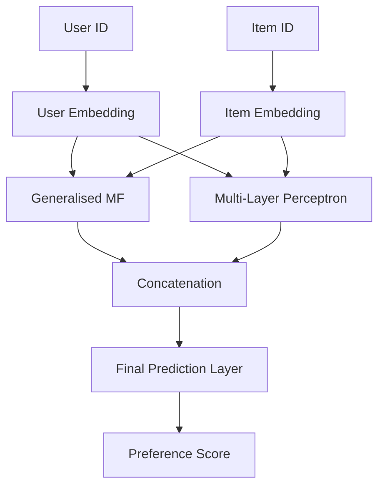
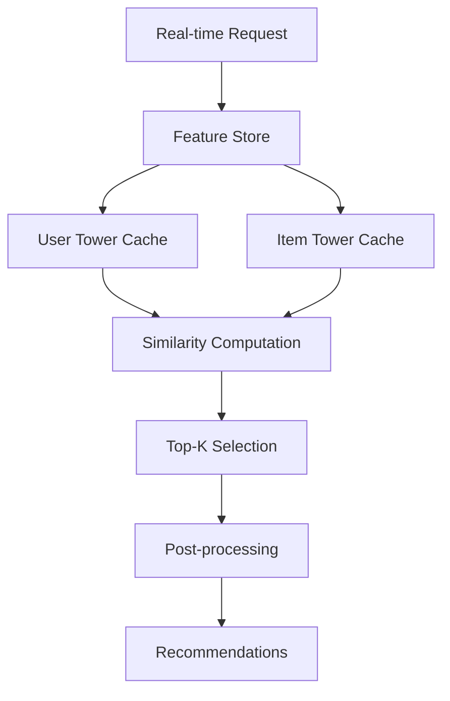
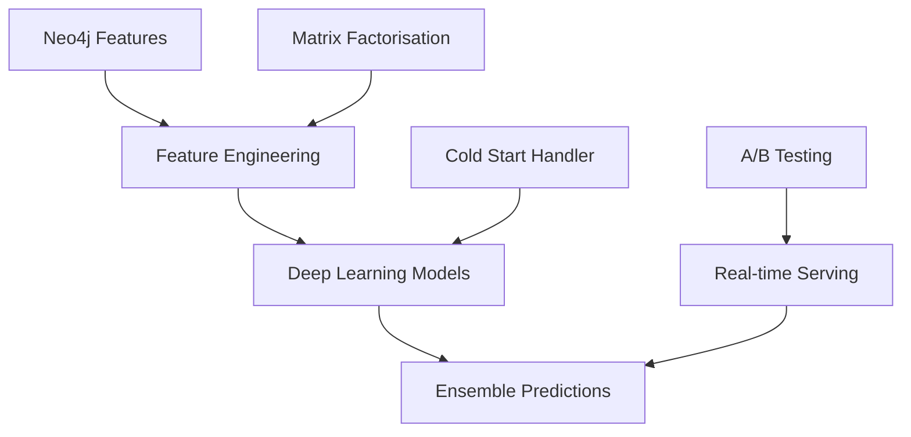

*When neural networks learn what linear algebra cannot*

Having explored [[7matrix-factorization-approaches|matrix factorisation]] and graph-based [[4content-based-recommendations-article|content-based]], [[5collaborative-filtering-article|collaborative]], and [[6fastrp-universal-embeddings-article|embedding]] approaches, we now venture into the realm of deep learning for recommendation systems. This article examines how neural architectures, particularly Two-Tower models and Neural Collaborative Filtering (NCF), can capture complex user-item interactions whilst leveraging the rich feature ecosystem we've built with Neo4j and PyTorch Lightning.

## The Deep Learning Paradigm Shift

Traditional matrix factorisation assumes linear relationships between latent factors. Deep learning breaks this assumption, enabling the modelling of non-linear interactions that better capture real-world user behaviour patterns. For Steam's complex ecosystem—where game preferences depend on intricate combinations of genres, social connections, and temporal factors—neural approaches offer compelling advantages.



## Two-Tower Architecture: Scaling Deep Recommendations

The Two-Tower architecture addresses the fundamental challenge of recommendation systems: efficiently computing similarities between users and items at scale whilst maintaining the expressiveness of deep neural networks.

### Architectural Foundation



The elegance lies in the separation: user and item embeddings are computed independently, enabling pre-computation and efficient serving at scale.

### Mathematical Framework

For a user $u$ and item $i$, the Two-Tower model learns:

$$\text{score}(u, i) = f_u(\mathbf{x}_u)^T \cdot f_i(\mathbf{x}_i)$$

Where:
- $f_u(\mathbf{x}_u)$ is the user tower mapping user features to embeddings
- $f_i(\mathbf{x}_i)$ is the item tower mapping item features to embeddings
- The dot product captures preference alignment

### Implementation with PyTorch Lightning

```python
import torch
import torch.nn as nn
import pytorch_lightning as pl
from torch.nn import functional as F

class TwoTowerModel(pl.LightningModule):
    def __init__(self, user_features_dim, item_features_dim, 
                 embedding_dim=128, hidden_dims=[256, 128]):
        super().__init__()
        
        # User tower
        self.user_tower = self._build_tower(
            user_features_dim, embedding_dim, hidden_dims
        )
        
        # Item tower
        self.item_tower = self._build_tower(
            item_features_dim, embedding_dim, hidden_dims
        )
        
        self.save_hyperparameters()
    
    def _build_tower(self, input_dim, output_dim, hidden_dims):
        """Build a tower with batch normalisation and dropout"""
        layers = []
        prev_dim = input_dim
        
        for hidden_dim in hidden_dims:
            layers.extend([
                nn.Linear(prev_dim, hidden_dim),
                nn.BatchNorm1d(hidden_dim),
                nn.ReLU(),
                nn.Dropout(0.2)
            ])
            prev_dim = hidden_dim
        
        # Final projection to embedding space
        layers.append(nn.Linear(prev_dim, output_dim))
        
        return nn.Sequential(*layers)
    
    def forward(self, user_features, item_features):
        user_embeddings = self.user_tower(user_features)
        item_embeddings = self.item_tower(item_features)
        
        # L2 normalise for cosine similarity
        user_embeddings = F.normalize(user_embeddings, p=2, dim=1)
        item_embeddings = F.normalize(item_embeddings, p=2, dim=1)
        
        return user_embeddings, item_embeddings
    
    def training_step(self, batch, batch_idx):
        user_features, item_features, labels = batch
        
        user_emb, item_emb = self(user_features, item_features)
        scores = torch.sum(user_emb * item_emb, dim=1)
        
        # Binary cross-entropy for implicit feedback
        loss = F.binary_cross_entropy_with_logits(scores, labels.float())
        
        self.log('train_loss', loss)
        return loss
```

### Feature Engineering for Steam Data

The Two-Tower architecture's strength lies in its ability to incorporate diverse features from our Neo4j ecosystem:



```python
def extract_steam_features(user_id, item_id, graph_session):
    """Extract rich features from Neo4j for Two-Tower model"""
    
    # User features from graph
    user_query = """
    MATCH (u:USER {steamid: $user_id})
    OPTIONAL MATCH (u)-[:PLAYED]->(games:APP)
    OPTIONAL MATCH (u)-[:FRIENDS]->(friends:USER)
    OPTIONAL MATCH (u)-[:MEMBER_OF]->(groups:GROUP)
    
    RETURN u.membership_duration as membership_duration,
           u.user_tot_playtime as total_playtime,
           count(DISTINCT games) as games_owned,
           count(DISTINCT friends) as friend_count,
           count(DISTINCT groups) as group_count,
           collect(DISTINCT games.genre_onehot) as genre_preferences
    """
    
    # Item features from graph
    item_query = """
    MATCH (app:APP {appid: $item_id})
    OPTIONAL MATCH (app)-[:HAS_GENRE]->(genres:GENRE)
    OPTIONAL MATCH (app)-[:DEVELOPED_BY]->(dev:DEVELOPER)
    
    RETURN app.app_tot_playtime as popularity,
           app.type_onehot as type_vector,
           collect(DISTINCT genres.name) as genres,
           dev.name as developer
    """
    
    user_data = graph_session.run(user_query, user_id=user_id).single()
    item_data = graph_session.run(item_query, item_id=item_id).single()
    
    return user_data, item_data
```

## Neural Collaborative Filtering: Beyond Linear Interactions

Neural Collaborative Filtering (NCF) extends traditional collaborative filtering by replacing the dot product with neural networks, enabling the capture of complex user-item interaction patterns.

### The NCF Framework



The key insight: combine the expressiveness of neural networks with the proven effectiveness of embedding-based collaborative filtering.

### Mathematical Formulation

NCF models the user-item interaction as:

$$\hat{y}_{ui} = f(\mathbf{P}_u, \mathbf{Q}_i | \mathbf{P}, \mathbf{Q}, \Theta_f)$$

Where:
- $\mathbf{P}_u$ and $\mathbf{Q}_i$ are user and item embeddings
- $f$ is a neural network with parameters $\Theta_f$
- The function $f$ can capture arbitrary user-item interactions

### Implementation Architecture

```python
class NeuralCollaborativeFiltering(pl.LightningModule):
    def __init__(self, n_users, n_items, embedding_dim=64, 
                 mlp_layers=[128, 64, 32], dropout=0.2):
        super().__init__()
        
        # Embedding layers
        self.user_embedding_mf = nn.Embedding(n_users, embedding_dim)
        self.item_embedding_mf = nn.Embedding(n_items, embedding_dim)
        
        self.user_embedding_mlp = nn.Embedding(n_users, embedding_dim)
        self.item_embedding_mlp = nn.Embedding(n_items, embedding_dim)
        
        # MLP layers
        mlp_input_dim = embedding_dim * 2
        self.mlp_layers = nn.ModuleList()
        
        for i, layer_size in enumerate(mlp_layers):
            if i == 0:
                self.mlp_layers.append(nn.Linear(mlp_input_dim, layer_size))
            else:
                self.mlp_layers.append(nn.Linear(mlp_layers[i-1], layer_size))
        
        # Final prediction layer
        final_input_dim = embedding_dim + mlp_layers[-1]
        self.prediction = nn.Linear(final_input_dim, 1)
        
        self.dropout = nn.Dropout(dropout)
        self.save_hyperparameters()
    
    def forward(self, user_ids, item_ids):
        # MF component
        user_emb_mf = self.user_embedding_mf(user_ids)
        item_emb_mf = self.item_embedding_mf(item_ids)
        mf_output = user_emb_mf * item_emb_mf
        
        # MLP component
        user_emb_mlp = self.user_embedding_mlp(user_ids)
        item_emb_mlp = self.item_embedding_mlp(item_ids)
        
        mlp_input = torch.cat([user_emb_mlp, item_emb_mlp], dim=-1)
        mlp_output = mlp_input
        
        for layer in self.mlp_layers:
            mlp_output = F.relu(layer(mlp_output))
            mlp_output = self.dropout(mlp_output)
        
        # Combine MF and MLP
        final_input = torch.cat([mf_output, mlp_output], dim=-1)
        prediction = torch.sigmoid(self.prediction(final_input))
        
        return prediction.squeeze()
```

## Advanced Feature Integration Strategies

### Incorporating Graph-Derived Features

The true power emerges when combining neural architectures with graph-derived features from our Neo4j infrastructure:

```python
class HybridNCF(pl.LightningModule):
    def __init__(self, n_users, n_items, graph_feature_dim, 
                 embedding_dim=64):
        super().__init__()
        
        # Traditional embeddings
        self.user_embedding = nn.Embedding(n_users, embedding_dim)
        self.item_embedding = nn.Embedding(n_items, embedding_dim)
        
        # Graph feature projections
        self.user_graph_projection = nn.Linear(
            graph_feature_dim, embedding_dim
        )
        self.item_graph_projection = nn.Linear(
            graph_feature_dim, embedding_dim
        )
        
        # Attention mechanism for feature fusion
        self.user_attention = nn.MultiheadAttention(
            embedding_dim, num_heads=4
        )
        self.item_attention = nn.MultiheadAttention(
            embedding_dim, num_heads=4
        )
    
    def forward(self, user_ids, item_ids, user_graph_features, 
                item_graph_features):
        # Standard embeddings
        user_emb = self.user_embedding(user_ids)
        item_emb = self.item_embedding(item_ids)
        
        # Graph-derived features
        user_graph_emb = self.user_graph_projection(user_graph_features)
        item_graph_emb = self.item_graph_projection(item_graph_features)
        
        # Attention-based fusion
        user_fused, _ = self.user_attention(
            user_emb.unsqueeze(0), 
            user_graph_emb.unsqueeze(0),
            user_graph_emb.unsqueeze(0)
        )
        
        item_fused, _ = self.item_attention(
            item_emb.unsqueeze(0),
            item_graph_emb.unsqueeze(0), 
            item_graph_emb.unsqueeze(0)
        )
        
        return user_fused.squeeze(0), item_fused.squeeze(0)
```

## Training Strategies and Optimisation

### Negative Sampling for Implicit Feedback

Steam's data is predominantly implicit (play time, purchases), requiring sophisticated negative sampling strategies:

```python
class ImplicitFeedbackDataset(torch.utils.data.Dataset):
    def __init__(self, interactions, n_negatives=4):
        self.interactions = interactions
        self.n_negatives = n_negatives
        self.item_pool = set(interactions['item_id'].unique())
        
        # Pre-compute user item sets for efficient negative sampling
        self.user_items = interactions.groupby('user_id')['item_id'].apply(set).to_dict()
    
    def __getitem__(self, idx):
        row = self.interactions.iloc[idx]
        user_id, pos_item_id = row['user_id'], row['item_id']
        
        # Positive sample
        samples = [(user_id, pos_item_id, 1.0)]
        
        # Negative samples
        user_items = self.user_items.get(user_id, set())
        available_items = self.item_pool - user_items
        
        neg_items = np.random.choice(
            list(available_items), 
            size=min(self.n_negatives, len(available_items)),
            replace=False
        )
        
        for neg_item in neg_items:
            samples.append((user_id, neg_item, 0.0))
        
        return samples
```

### Learning Rate Scheduling and Regularisation

```python
def configure_optimizers(self):
    optimizer = torch.optim.AdamW(
        self.parameters(), 
        lr=1e-3, 
        weight_decay=1e-5
    )
    
    scheduler = torch.optim.lr_scheduler.CosineAnnealingLR(
        optimizer, 
        T_max=100,
        eta_min=1e-6
    )
    
    return {
        'optimizer': optimizer,
        'lr_scheduler': {
            'scheduler': scheduler,
            'monitor': 'val_loss'
        }
    }
```

## Production Deployment Patterns

### Model Serving Architecture



### Efficient Serving Implementation

```python
class TwoTowerServing:
    def __init__(self, model_path, feature_store):
        self.model = torch.jit.load(model_path)
        self.feature_store = feature_store
        self.user_cache = {}
        self.item_embeddings = None
        
    def precompute_item_embeddings(self, item_features):
        """Pre-compute all item embeddings for efficiency"""
        with torch.no_grad():
            _, item_embeddings = self.model(
                torch.zeros(1, item_features.shape[1]),  # Dummy user
                item_features
            )
            self.item_embeddings = item_embeddings
    
    def get_recommendations(self, user_id, k=10):
        """Get top-k recommendations for user"""
        # Get or compute user embedding
        if user_id not in self.user_cache:
            user_features = self.feature_store.get_user_features(user_id)
            with torch.no_grad():
                user_emb, _ = self.model(
                    user_features.unsqueeze(0),
                    torch.zeros(1, self.item_embeddings.shape[1])  # Dummy item
                )
                self.user_cache[user_id] = user_emb.squeeze(0)
        
        user_embedding = self.user_cache[user_id]
        
        # Compute similarities
        similarities = torch.mm(
            user_embedding.unsqueeze(0), 
            self.item_embeddings.t()
        ).squeeze(0)
        
        # Get top-k
        top_k_scores, top_k_indices = torch.topk(similarities, k)
        
        return list(zip(top_k_indices.tolist(), top_k_scores.tolist()))
```

## Evaluation and Monitoring

See [[9recommendation-metrics|here]] for a deep-dive into recommender system metrics.

```python
class RecommenderEvaluator:
    def __init__(self, model, test_data):
        self.model = model
        self.test_data = test_data
    
    def evaluate_ranking_metrics(self, k_values=[5, 10, 20]):
        """Evaluate ranking metrics at different K values"""
        metrics = {}
        
        for k in k_values:
            precision_scores = []
            recall_scores = []
            ndcg_scores = []
            
            for user_id, true_items in self.test_data.items():
                pred_items = self.model.recommend(user_id, k)
                pred_set = set(pred_items)
                true_set = set(true_items)
                
                # Precision@K
                precision = len(pred_set & true_set) / len(pred_set)
                precision_scores.append(precision)
                
                # Recall@K
                recall = len(pred_set & true_set) / len(true_set)
                recall_scores.append(recall)
                
                # NDCG@K
                ndcg = self.calculate_ndcg(true_items, pred_items, k)
                ndcg_scores.append(ndcg)
            
            metrics[f'precision@{k}'] = np.mean(precision_scores)
            metrics[f'recall@{k}'] = np.mean(recall_scores)
            metrics[f'ndcg@{k}'] = np.mean(ndcg_scores)
        
        return metrics
```

## Integration with Existing Pipeline

The deep learning models integrate seamlessly with our existing Neo4j and matrix factorisation infrastructure:



## Looking Ahead: Future Directions

Deep learning for recommendations continues evolving rapidly. Promising directions include:

- **Graph Neural Networks** for better structural understanding
- **Transformer architectures** for sequential recommendation
- **Multi-task learning** for unified user understanding
- **Causal inference** for unbiased recommendation

In our next article, we'll explore how to systematically evaluate and compare these diverse approaches, establishing robust metrics that align with business objectives whilst maintaining scientific rigour.

## Conclusion

Deep learning transforms recommendation systems from pattern matching to genuine understanding of user preferences. The Two-Tower architecture provides scalable serving whilst NCF enables complex interaction modelling. When combined with our rich Neo4j feature ecosystem, these approaches deliver recommendation systems that are both performant and interpretable.

The Steam recommender system demonstrates how classical techniques, graph databases, and modern deep learning can work in harmony, each contributing their strengths to create a robust, production-ready recommendation engine.