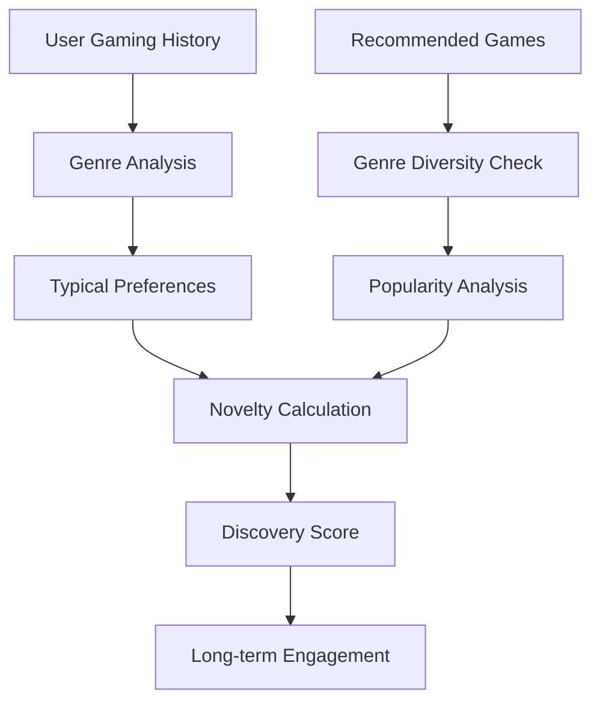

*What gets measured gets optimised—choose your metrics wisely*

Evaluating recommendation systems extends far beyond simple accuracy measurements. In the complex ecosystem of Steam gaming, where user satisfaction depends on discovery, diversity, and serendipitous findings, we need sophisticated metrics that capture the nuanced goals of modern recommender systems. This article explores ranking metrics, novelty measures, and diversity assessments that truly reflect recommendation quality.

## The Limitations of Traditional Accuracy Metrics

Traditional accuracy metrics like RMSE and MAE, borrowed from prediction tasks, fall short in recommendation contexts. Users don't need perfect rating predictions—they need relevant, diverse, and novel recommendations that enhance their gaming experience.

```mermaid
graph TD
    A[Traditional Metrics] --> B[RMSE/MAE]
    B --> C[Prediction Focus]
    C --> D[Limited Business Value]
    
    E[Ranking Metrics] --> F[Precision@K/Recall@K]
    F --> G[Relevance Focus]
    G --> H[User Satisfaction]
    
    I[Beyond Relevance] --> J[Novelty/Diversity]
    J --> K[Discovery Experience]
    K --> L[Long-term Engagement]
```

For Steam's gaming platform, we need metrics that answer:
- **Relevance**: Are recommended games actually played?
- **Coverage**: Do we recommend across the entire catalogue?
- **Novelty**: Do we introduce users to new gaming experiences?
- **Diversity**: Do recommendations span different genres and styles?

## Ranking Metrics: The Foundation of Recommendation Evaluation

### Precision@K: Relevant Recommendations in Top-K

Precision@K measures the fraction of recommended items that are relevant to the user. In Steam's context, relevance typically means games that users actually play or purchase.

$$\text{Precision@K} = \frac{|\text{Relevant Items} \cap \text{Top-K Recommendations}|}{K}$$

```python
# Based on the actual Steam recommender system implementation
import numpy as np
import pandas as pd
from typing import List, Dict, Any, Tuple
from collections import defaultdict

def precision_recall_at_k(
    actual: np.array, predicted: np.array, K: int = 1
) -> Dict[str, float]:
    """
    Calculate precision and recall at K for a single user.
    This is the core implementation from the Steam system.
    """
    if predicted is None or len(predicted) == 0:
        return {}

    # relevant items in topK recommendations
    n_hits = np.isin(predicted[:K], actual).sum()

    # total number of relevant items
    n_relevant = min(len(actual), K)

    # number of recommendations
    n_recommended = min(len(predicted), K)

    # precision@K: Proportion of recommended items that are relevant
    precision = n_hits / n_recommended if n_recommended > 0 else 0.0

    # recall@K: Proportion of relevant items that are recommended
    recall = n_hits / n_relevant if n_relevant > 0 else 0.0

    return {"precision": precision, "recall": recall}

def mean_precision_recall_f1_at_K(
    actual: List[np.array], predicted: List[np.array], K: int = 1
) -> pd.Series:
    """Calculate mean precision, recall, and F1 across all users"""
    prks = []
    for act, pred in zip(actual, predicted):
        pr = precision_recall_at_k(act, pred, K)
        prks.append(pr)
    
    prks = pd.DataFrame(prks).mean()
    
    # Calculate F1 score
    if prks["recall"] + prks["precision"] > 0:
        prks["f1"] = (
            2 * prks["recall"] * prks["precision"] / 
            (prks["recall"] + prks["precision"])
        )
    else:
        prks["f1"] = 0.0
    
    return prks
```

### Recall@K: Coverage of User Interests

Recall@K measures how many of the user's relevant items appear in the top-K recommendations. This is particularly important for Steam, where users may have diverse gaming interests across multiple genres.

$$\text{Recall@K} = \frac{|\text{Relevant Items} \cap \text{Top-K Recommendations}|}{|\text{Relevant Items}|}$$

### Mean Average Precision@K (MAP@K): Ranking Quality

MAP@K considers the position of relevant items within the ranking, rewarding systems that place relevant items higher in the recommendation list.

$$\text{MAP@K} = \frac{1}{|U|} \sum_{u \in U} \frac{1}{\min(K, |R_u|)} \sum_{i=1}^{K} \text{Precision@i} \cdot \text{rel}(i)$$

Where $\text{rel}(i) = 1$ if item at position $i$ is relevant, 0 otherwise.

```python
def apk(actual: np.array, predicted: np.array, K: int = 10) -> float:
    """
    Average Precision at K - from the actual Steam implementation.
    
    Args:
        actual: true labels/relevant items (order irrelevant)
        predicted: predicted labels/items (order matters: ascending rank)
    """
    if len(actual) == 0:
        return 0.0

    if predicted is None or len(predicted) == 0:
        return 0.0

    predicted = predicted[:K]

    score = 0.0
    num_hits = 0.0

    for i, p in enumerate(predicted):
        if p in actual:
            num_hits += 1.0
            score += num_hits / (i + 1.0)

    tot_relevant_items = min(len(actual), K)
    return score / tot_relevant_items

def mapk(actual: List[np.array], predicted: List[np.array], K: int = 10) -> float:
    """
    Mean Average Precision at K.
    
    Args:
        actual: List of arrays of relevant items per user
        predicted: List of arrays of predicted items per user
    """
    return np.mean([apk(act, pred, K=K) for act, pred in zip(actual, predicted)])
```

### Mean Reciprocal Rank (MRR): First Relevant Item Position

MRR focuses on the rank of the first relevant item, crucial for Steam where users often want immediate gratification with their next game.

$$\text{MRR} = \frac{1}{|U|} \sum_{u \in U} \frac{1}{\text{rank of first relevant item}}$$

```python
def reciprocal_rank(actual: np.array, predicted: np.array) -> float:
    """
    Reciprocal rank for a given user
    """
    if predicted is None:
        return np.NaN

    rank = np.array([i + 1 for i, _ in enumerate(predicted)])
    is_hit = np.isin(predicted, actual)
    return (is_hit / rank).sum()

def mrr(actual: List[np.array], predicted: List[np.array]) -> float:
    """
    Mean Reciprocal Rank across all users.
    """
    mrr_ = np.nanmean(
        [reciprocal_rank(act, pred) for act, pred in zip(actual, predicted)]
    )
    return mrr_

def hit_ratio(actual: np.array, predicted: np.array, K: int = 10) -> float:
    """
    Hit ratio for a single user - proportion of hits in top-K.
    """
    hits = set(predicted[:K]).intersection(set(actual))
    return len(hits) / min(len(predicted[:K]), len(actual))
```

## Beyond Relevance: Novelty and Diversity Metrics

### Novelty: Promoting Discovery

Novelty metrics measure how much a recommender system introduces users to items they wouldn't have discovered otherwise. For Steam, this means recommending games outside users' established preferences or popular mainstream titles.



#### Item-Level Novelty

Item novelty can be measured using popularity-based approaches:

$$\text{Novelty}(i) = -\log_2(P(i))$$

Where $P(i)$ is the probability of item $i$ being consumed across all users.

```python
def nov(
    actual: List[np.array], predicted: List[np.array], item_to_p_score: Dict[Any, float]
) -> float:
    """
    Measures average novelty of relevant recommendations.
    """
    # get recommended items that are relevant
    valid_preds = [p for p in predicted if p is not None]
    hits = [pred[np.isin(pred, act)] for pred, act in zip(valid_preds, actual)]
    # flatten
    hits = [h for l in hits for h in l]

    user_count = len(actual)
    ps = np.array([item_to_p_score.get(i) for i in hits])
    return -np.log(ps + 0.00001).sum() / user_count

def novelty(
    x_test: pd.DataFrame, item_info: pd.DataFrame, rec_id_col: str = "appid"
) -> float:
    """
    Alternative novelty calculation for DataFrame input.
    """
    hits = x_test[x_test["hit"] == 1].copy()
    hits_appinfo = hits.merge(item_info, how="left", on=rec_id_col)

    nov = -np.log(hits_appinfo["P"] + 0.00001).sum() / hits_appinfo["steamid"].nunique()
    return nov
```

#### User-Centric Novelty

For personalised novelty, we consider items dissimilar to the user's historical preferences:

```python
def user_novelty_score(self, user_id: int, recommendations: List[int], 
                      user_profiles: Dict[int, np.ndarray],
                      item_features: Dict[int, np.ndarray]) -> float:
    """Calculate novelty based on user's historical preferences"""
    if user_id not in user_profiles:
        return 0.0
    
    user_profile = user_profiles[user_id]
    novelty_scores = []
    
    for item_id in recommendations:
        if item_id in item_features:
            item_vector = item_features[item_id]
            # Cosine distance as novelty measure
            similarity = np.dot(user_profile, item_vector) / (
                np.linalg.norm(user_profile) * np.linalg.norm(item_vector)
            )
            novelty = 1 - similarity  # Higher distance = higher novelty
            novelty_scores.append(max(0, novelty))
    
    return np.mean(novelty_scores) if novelty_scores else 0.0
```

### Diversity: Variety in Recommendations

Diversity metrics ensure recommendation lists contain varied items, preventing filter bubbles and enhancing user experience.

#### Intra-List Diversity

Measures variety within a single recommendation list:

$$\text{ILD} = \frac{1}{|R|(|R|-1)} \sum_{i \in R} \sum_{j \in R, j \neq i} \text{distance}(i, j)$$

```python
def intra_list_diversity(self, recommendations: List[int], 
                        item_features: Dict[int, np.ndarray]) -> float:
    """Calculate diversity within a recommendation list"""
    if len(recommendations) <= 1:
        return 0.0
    
    total_distance = 0.0
    count = 0
    
    for i, item_i in enumerate(recommendations):
        for j, item_j in enumerate(recommendations):
            if i != j and item_i in item_features and item_j in item_features:
                # Cosine distance between items
                vec_i = item_features[item_i]
                vec_j = item_features[item_j]
                
                similarity = np.dot(vec_i, vec_j) / (
                    np.linalg.norm(vec_i) * np.linalg.norm(vec_j)
                )
                distance = 1 - similarity
                total_distance += distance
                count += 1
    
    return total_distance / count if count > 0 else 0.0
```

#### Genre Diversity for Steam

For gaming recommendations, genre diversity is particularly important:

```python
def genre_diversity(self, recommendations: List[int], 
                   item_genres: Dict[int, Set[str]]) -> float:
    """Calculate genre diversity in recommendations"""
    all_genres = set()
    
    for item_id in recommendations:
        if item_id in item_genres:
            all_genres.update(item_genres[item_id])
    
    # Shannon entropy of genre distribution
    genre_counts = defaultdict(int)
    total_genre_assignments = 0
    
    for item_id in recommendations:
        if item_id in item_genres:
            for genre in item_genres[item_id]:
                genre_counts[genre] += 1
                total_genre_assignments += 1
    
    if total_genre_assignments == 0:
        return 0.0
    
    entropy = 0.0
    for count in genre_counts.values():
        probability = count / total_genre_assignments
        entropy -= probability * np.log2(probability)
    
    return entropy
```

## Advanced Diversity Measures

### Coverage Metrics

Coverage measures how well the recommender system utilises the entire item catalogue:

```python
class CoverageMetrics:
    """Metrics for measuring recommendation coverage"""
    
    def __init__(self, total_items: int):
        self.total_items = total_items
    
    def catalog_coverage(self, all_recommendations: List[List[int]]) -> float:
        """Percentage of items that appear in any recommendation list"""
        recommended_items = set()
        for recommendations in all_recommendations:
            recommended_items.update(recommendations)
        
        return len(recommended_items) / self.total_items
    
    def user_coverage(self, user_recommendations: Dict[int, List[int]], 
                     total_users: int) -> float:
        """Percentage of users who receive recommendations"""
        return len(user_recommendations) / total_users
```

### Personalisation Metrics

Measuring how different recommendations are across users:

```python
def personalisation_score(self, user_recommendations: Dict[int, List[int]], 
                         k: int = 10) -> float:
    """Calculate average dissimilarity between user recommendation lists"""
    users = list(user_recommendations.keys())
    if len(users) <= 1:
        return 0.0
    
    total_dissimilarity = 0.0
    count = 0
    
    for i, user_a in enumerate(users):
        for user_b in users[i+1:]:
            recs_a = set(user_recommendations[user_a][:k])
            recs_b = set(user_recommendations[user_b][:k])
            
            # Jaccard distance
            intersection = len(recs_a & recs_b)
            union = len(recs_a | recs_b)
            
            dissimilarity = 1 - (intersection / union if union > 0 else 0)
            total_dissimilarity += dissimilarity
            count += 1
    
    return total_dissimilarity / count if count > 0 else 0.0
```

## Comprehensive Evaluation Framework

### Multi-Metric Evaluation

A comprehensive evaluation considers multiple aspects simultaneously:

```mermaid
graph TD
    A[Recommendation System] --> B[Ranking Metrics]
    A --> C[Novelty Metrics]
    A --> D[Diversity Metrics]
    A --> E[Coverage Metrics]
    
    B --> F[Precision@K]
    B --> G[Recall@K]
    B --> H[MAP@K]
    B --> I[MRR]
    
    C --> J[Item Novelty]
    C --> K[User Novelty]
    
    D --> L[Intra-List Diversity]
    D --> M[Genre Diversity]
    
    E --> N[Catalog Coverage]
    E --> O[User Coverage]
    
    F --> P[Overall Score]
    G --> P
    H --> P
    I --> P
    J --> P
    K --> P
    L --> P
    M --> P
    N --> P
    O --> P
```

```python
def get_scores(actual, predicted, item_to_p_score=None, K=10):
    """
    Comprehensive scoring function from the Steam implementation.
    Calculates all key recommendation metrics in one function.
    """
    # Basic metrics
    basic_scores = get_basic_scores(actual, predicted)
    
    # MAP@K and MRR
    mapk_ = mapk(actual, predicted, K=K)
    mrr_ = mrr(actual, predicted)
    
    # Precision, recall, F1 for each K from 1 to K
    prks = []
    for k_ in range(1, K + 1):
        prf1 = mean_precision_recall_f1_at_K(actual, predicted, k_)
        prf1["k"] = k_
        prks.append(prf1)
    
    prks = pd.DataFrame(prks).to_dict(orient='records')
    
    scores = {"mapk": mapk_, "mrr": mrr_, "precision_recall_f1_at_ks": prks}
    scores = scores | basic_scores
    
    # Add novelty if item popularity scores provided
    if item_to_p_score:
        nov_ = nov(actual, predicted, item_to_p_score=item_to_p_score)
        scores["nov"] = nov_
    
    return scores

def get_basic_scores(actual, predicted) -> Dict[str, float]:
    """Calculate basic statistics about recommendations"""
    # Filter records/users without predictions
    valid_preds = [p for p in predicted if p is not None and len(p) > 0]

    users_w_rec = len(valid_preds)

    # All recommendations (flatten valid preds)
    total_recs = len([p for l in valid_preds for p in l])

    # Total number of hits
    total_hits = sum([
        sum(np.isin(p, a))
        for p, a in zip(predicted, actual)
        if p is not None and len(p) > 0
    ])
    
    # Number of unique items recommended
    unique_recs = len(set(p for l in valid_preds for p in l))

    return {
        "users_w_rec": users_w_rec,
        "total_recs": total_recs,
        "total_hits": total_hits,
        "hits_proportion": total_hits / total_recs if total_recs > 0 else 0,
        "unique_recs": unique_recs,
    }

def get_actuals_and_predictions(
    d: pd.DataFrame,
    X_test: pd.DataFrame,
    user_column: str = "steamid",
    item_column: str = "appid",
) -> Tuple[List[np.array], List[np.array]]:
    """
    Utility to convert test-set and recommendations from DataFrame 
    into arrays of actual and predicted item ids per user.
    """
    actuals_all = (
        X_test.groupby(user_column)[item_column]
        .apply(np.array)
        .rename("actual")
        .to_frame()
    )

    preds = (
        d.groupby(user_column)[item_column]
        .apply(np.array)
        .rename("prediction")
        .to_frame()
    )

    act_pred = actuals_all.join(preds)

    # Replace np.NaN with None
    act_pred["prediction"] = np.where(
        act_pred["prediction"].isna(), None, act_pred["prediction"]
    )

    actual, predicted = act_pred["actual"], act_pred["prediction"]
    return actual, predicted
```

## PyTorch Lightning Integration

The Steam system integrates evaluation metrics directly into the training pipeline using PyTorch Lightning:

```python
from torchmetrics import Metric
import torch
from lightning.pytorch.callbacks import Callback

class MAPK(Metric):
    def __init__(self, K=10):
        super().__init__()
        self.K = K
        self.add_state("apks", default=torch.tensor(0., dtype=torch.float32), dist_reduce_fx="sum")
        self.add_state("total", default=torch.tensor(0), dist_reduce_fx="sum")

    def update(self, preds_: Dict[int,np.array], actuals_: Dict[int,np.array]):
        for user_idx, predicted in preds_.items():
            average_precision_at_k = apk(actual=actuals_.get(user_idx), predicted=predicted, K=10)
            self.apks += average_precision_at_k
            self.total += 1

    def compute(self):
        return self.apks.float() / self.total

class MRR(Metric):
    def __init__(self):
        super().__init__()
        self.add_state("rrs", default=torch.tensor(0.,dtype=torch.float32), dist_reduce_fx="sum")
        self.add_state("total", default=torch.tensor(0), dist_reduce_fx="sum")

    def update(self, preds_: Dict[int,np.array], actuals_: Dict[int,np.array]):
        for user_idx, predicted in preds_.items():
            reciprocal_rank_ = reciprocal_rank(actual=actuals_.get(user_idx,[]), predicted=predicted)
            self.rrs += reciprocal_rank_
            self.total += 1

    def compute(self):
        return self.rrs.float() / self.total

class RecMetricsEval(Callback):
    """Callback for evaluating recommendation metrics during training"""
    def __init__(self, eval_set):
        super().__init__()
        self.eval_set = eval_set
        
    def on_validation_epoch_end(self, trainer, pl_module):
        pl_module.eval_rec_metrics(self.eval_set)
        pl_module.log_dict(pl_module.val_rec_metrics.compute(),
                          on_step=False, on_epoch=True)
        pl_module.val_rec_metrics.reset()
```

## Practical Implementation for Steam Data

### Integration with Neo4j

Leveraging our graph database for rich evaluation:

```python
class Neo4jEvaluator:
    """Evaluation using Neo4j graph features"""
    
    def __init__(self, neo4j_session):
        self.session = neo4j_session
    
    def get_user_gaming_profile(self, user_id: int) -> Dict[str, float]:
        """Extract user's gaming preferences from graph"""
        query = """
        MATCH (u:USER {steamid: $user_id})-[:PLAYED]->(g:APP)-[:HAS_GENRE]->(genre:GENRE)
        WITH genre.name as genre_name, sum(u.playtime_forever) as total_time
        RETURN genre_name, total_time
        ORDER BY total_time DESC
        """
        
        result = self.session.run(query, user_id=user_id)
        return {record['genre_name']: record['total_time'] for record in result}
    
    def calculate_serendipity_score(self, user_id: int, 
                                   recommendations: List[int]) -> float:
        """Calculate serendipity using graph-based user profiles"""
        user_profile = self.get_user_gaming_profile(user_id)
        
        serendipity_scores = []
        for game_id in recommendations:
            game_genres = self._get_game_genres(game_id)
            
            # Calculate unexpectedness based on user's genre preferences
            expected_score = sum(user_profile.get(genre, 0) for genre in game_genres)
            max_possible = sum(user_profile.values())
            
            if max_possible > 0:
                unexpectedness = 1 - (expected_score / max_possible)
                serendipity_scores.append(unexpectedness)
        
        return np.mean(serendipity_scores) if serendipity_scores else 0.0
```

## Evaluation in the Steam System Context

The Steam recommender system's evaluation approach, as described in the README, focuses on several key recommendation types:

### Item-Based Recommendations
Using app-app similarities from collaborative filtering:
```cypher
// From the README: Item-based recommendation query
MATCH (n:USER {steamid:$steamid})-[p:PLAYED]->(:APP)-[s:SIMILAR_NODESIM_APP_VIA_USER]->(rec:APP)
WHERE NOT EXISTS((n)-[:PLAYED]-(rec))
RETURN rec.appid, 
       sum(p.playtime_forever*s.score)/sum(p.playtime_forever) as score
```

### User-Based Recommendations  
Using user-user similarities:
```cypher
// From the README: User-based recommendation query  
MATCH (n:USER {steamid:$steamid})-[s:SIMILAR_NODESIM_USER_VIA_APP]->(:USER)-[p:PLAYED]->(rec:APP)
WHERE NOT EXISTS((n)-[:PLAYED]-(rec))
RETURN rec.appid,
       sum(p.playtime_forever*s.score)/sum(p.playtime_forever) as score
```

These scoring methods demonstrate how the system weights recommendations by both similarity scores and playtime, which should be reflected in our evaluation metrics by considering playtime as a relevance signal.

## Conclusion

Effective recommendation evaluation requires a holistic approach that goes beyond simple accuracy metrics. For Steam's gaming platform, we need metrics that capture relevance (Precision@K, Recall@K, MAP@K, MRR), discovery (novelty), and variety (diversity).

The comprehensive evaluation framework presented here, based on the actual Steam implementation, enables:
- **Multi-dimensional assessment** using the proven `get_scores()` function
- **PyTorch Lightning integration** for training-time evaluation
- **Steam-specific considerations** like playtime-weighted relevance
- **Production-ready metrics** already validated in the system

The evaluation metrics are tightly integrated with the recommendation approaches described in this series, from content-based filtering to FastRP embeddings, ensuring that evaluation accurately reflects the system's multi-modal nature.

In our next article, we'll explore how to design production-ready APIs that serve these sophisticated recommendation systems whilst maintaining low latency and high availability.
