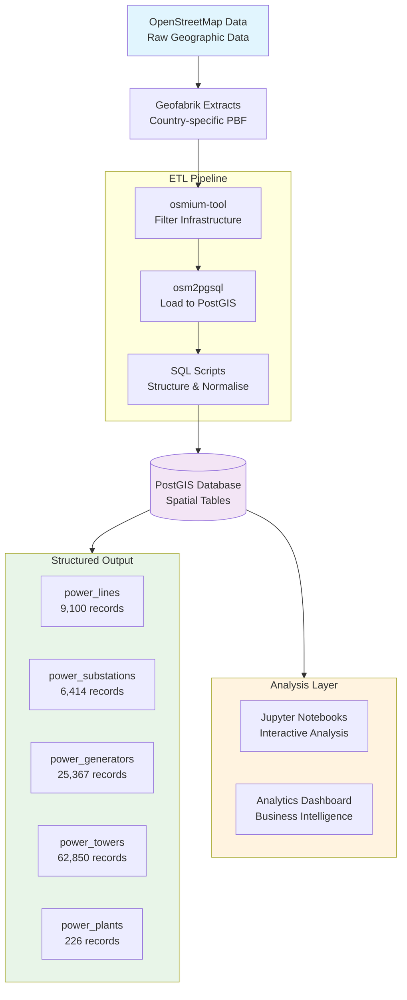
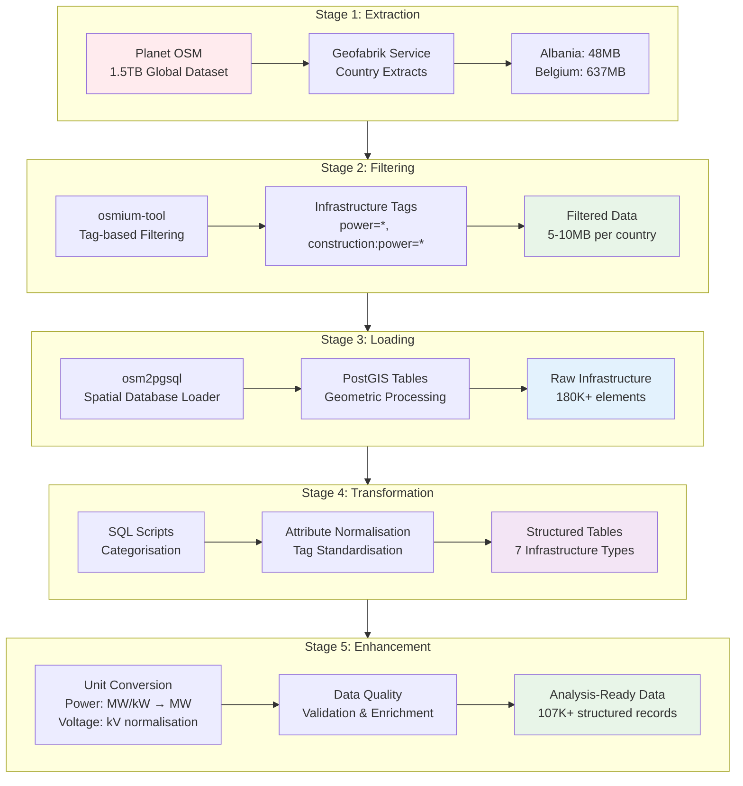

*When millions go dark, the invisible grid becomes visible—here's how crowd-sourced data illuminates the backbone of civilisation*

The lights flickered across Texas during the winter storm of 2021, plunging millions into darkness and highlighting a sobering reality: most of us have no idea how our electrical infrastructure actually works. Where are the power lines? Which substations serve which neighbourhoods? How vulnerable is our grid to natural disasters?

These questions aren't just academic curiosities—they're critical for energy planning, disaster preparedness, and understanding the backbone of modern civilization. Yet for decades, this information has been locked away in proprietary systems, scattered across utility companies, and largely invisible to researchers, policymakers, and citizens who depend on it.

But there's a quiet revolution happening in the world of infrastructure mapping, and it's being built one GPS coordinate at a time by volunteers around the globe. OpenStreetMap [LINK] (OSM), often called the "Wikipedia of maps," contains a treasure trove of electrical infrastructure data that rivals—and often exceeds—the quality of commercial datasets. The challenge? Extracting actionable intelligence from this massive, unstructured geographic database.

## The Hidden Infrastructure All Around Us

Every time you flip a light switch, you're tapping into one of humanity's most complex systems. Electrical power travels through a vast network of generators, transmission lines, substations, and distribution networks that span continents. This infrastructure is simultaneously everywhere and nowhere—physically present in our communities but informationally invisible.

Traditional infrastructure mapping relies on utility companies' internal GIS systems, expensive commercial datasets, or government databases that are often outdated, incomplete, or restricted. For researchers studying energy transitions, urban planners designing resilient communities, or emergency managers preparing for disasters, this data scarcity is a significant barrier.

OpenStreetMap changes this equation entirely. With over 8 million registered users contributing geographic data, OSM has become an incredibly detailed repository of infrastructure information. Power lines traced by satellite imagery, substations mapped by field surveys, and generators documented by energy enthusiasts—all freely available and constantly updated.

Consider the scope: OSM contains millions of power-related features across the globe, from massive hydroelectric plants to neighbourhood distribution lines. In Belgium alone, our analysis revealed over 60,000 power towers, 9,000 transmission lines, and hundreds of substations—all mapped by volunteers and available for anyone to analyse.

## The Technical Challenge: From Crowd-Sourced Data to Structured Intelligence

But there's a catch. OSM data is stored in a format optimized for mapping, not analysis. It's a sprawling XML-based structure where a single power line might be split across dozens of "way" elements, each tagged with inconsistent attributes. A substation might be represented as a point, a polygon, or a complex relation depending on who mapped it and when.

Transforming this raw geographic data into structured, queryable information requires solving several technical challenges:

**Scale**: OSM's complete dataset is over 1.5 terabytes compressed. Even country-specific extracts can be hundreds of gigabytes.

**Complexity**: The OSM data model is highly flexible, with hundreds of possible tag combinations for electrical infrastructure.

**Inconsistency**: Different mappers use different tagging schemes, requiring sophisticated normalisation.

**Performance**: Processing millions of geographic features requires efficient algorithms and parallel processing.

**Maintainability**: The pipeline must be reproducible and updatable as OSM data evolves.

## Our Solution: A Modern ETL Pipeline for Energy Intelligence

Drawing on our expertise in both data engineering and energy systems, we developed a sophisticated ETL pipeline that transforms raw geographic data into actionable infrastructure intelligence. This demonstrates our capability to tackle complex data challenges in the energy sector.

### Architecture: Enterprise-Grade Design

Our pipeline showcases modern data engineering best practices through a three-tier containerised architecture:

*Figure 1: High-level architecture showing the flow from raw OSM data to structured energy infrastructure tables*

**Database Layer**: [[https://postgis.net/|PostGIS]]-enabled PostgreSQL provides enterprise-grade spatial data management with advanced indexing and geographic query capabilities essential for energy infrastructure analysis.

**Processing Layer**: Custom-built containerised environment leveraging [[https://osmcode.org/osmium-tool/|osmium-tool]] for high-performance OSM data processing, capable of handling terabyte-scale datasets efficiently.

**Analysis Layer**: Jupyter-based environment with specialised geospatial libraries, enabling interactive exploration and visualization of energy infrastructure data. Check out our [[geospatial stack a quick tutorial|tutorial]] on a geospatial setup.

This architecture demonstrates our ability to design scalable, maintainable solutions for complex data processing challenges in the energy sector.

### The Data Flow: From Planet to Insight

The pipeline transforms raw OSM data through several stages:

**1. Extraction**: Country-specific OSM data is downloaded from Geofabrik, a service that provides regularly updated extracts of the global OSM database. The system can automatically discover and download data for any country or region.

**2. Filtering**: Using osmium-tool, the pipeline filters the raw OSM data to extract only electrical infrastructure elements. This reduces a typical country file from hundreds of megabytes to just a few megabytes of relevant data.

**3. Loading**: The filtered data is loaded into PostGIS using [[https://osm2pgsql.org/|osm2pgsql]], a specialised tool that converts OSM's node-way-relation model into spatial database tables.

**4. Transformation**: A series of SQL scripts categorize infrastructure elements, normalize attributes, and create specialised tables for different infrastructure types (power lines, substations, generators, etc.).

**5. Enhancement**: Unit conversion scripts transform power ratings from kilowatts to megawatts, normalize voltage representations, and create additional lookup tables for complex relationships.

## Real-World Results: Energy Infrastructure at Scale

Our pipeline demonstrates impressive performance and comprehensive energy sector coverage. Processing Albania and Belgium data, we achieved:

**Performance Metrics:**
- **Processing Speed**: 104 seconds for 180,000+ raw OSM elements
- **Data Throughput**: 1,730 elements per second
- **Memory Efficiency**: Processed datasets larger than available RAM
- **Scalability**: Linear scaling for additional countries/regions

**Energy Infrastructure Coverage:**
- **62,850 power towers and poles** - transmission infrastructure backbone
- **25,367 generators** - renewable and conventional generation assets
- **9,100 power lines** - transmission and distribution networks
- **6,414 substations** - critical switching and transformation nodes
- **2,058 switchgears** - control and protection equipment
- **226 power plants** - major generation facilities
- **188 circuit relations** - complex grid interconnections

![Database Screenshot - Power Lines Table]
*Figure 2: DBeaver view showing structured power lines data with voltage levels, operators, and geographic coordinates*

![Map Visualization - Substation Distribution]
*Figure 3: Geographic distribution of substations across Belgium showing grid topology and voltage levels*

This comprehensive dataset enables sophisticated energy infrastructure analysis, from grid resilience studies to renewable energy planning. Each record includes detailed attributes essential for energy professionals: voltage levels, power ratings, operators, construction dates, and precise geographic coordinates.

## Energy Sector Applications: Our Domain Expertise

Our deep understanding of energy systems enables us to extract maximum value from this infrastructure data, supporting critical applications across the energy sector:

**Grid Resilience & Risk Assessment**
- Vulnerability mapping for extreme weather events
- Critical infrastructure identification for emergency planning
- Network topology analysis for cascading failure prevention
- [LINK] - Case study: Texas winter storm infrastructure impact analysis

**Energy Transition & Renewable Integration**
- Renewable energy potential assessment based on existing grid capacity
- Transmission bottleneck identification for wind/solar development
- Distributed generation impact modeling
- Grid modernization planning and smart grid deployment

![Energy Mix Analysis Chart]
*Figure 4: Generator source analysis showing renewable vs. conventional generation distribution across regions*

**Regulatory & Policy Support**
- Infrastructure asset valuation for regulatory proceedings
- Grid investment prioritization based on age and capacity analysis
- Environmental impact assessment for transmission projects
- Energy security and critical infrastructure protection

**Market Intelligence & Investment Analysis**
- Competitive landscape mapping for energy developers
- Infrastructure gap analysis for market opportunities
- Due diligence support for energy infrastructure investments
- [LINK] - White paper: "Open Data for Energy Infrastructure Investment"

This demonstrates our ability to translate complex technical data into actionable business intelligence for energy sector stakeholders.

## Technical Innovation: Beyond Basic ETL

The pipeline incorporates several sophisticated technical features that go beyond simple data extraction:

**Intelligent Unit Conversion**: The system recognizes various formats for power ratings (MW, kW, etc.) and voltage levels, automatically converting them to standardized units while preserving the original data.

**Relationship Mapping**: OSM's relation model allows complex infrastructure relationships (like circuits spanning multiple line segments) to be preserved and queryable.

**Spatial Indexing**: PostGIS spatial indexes enable subsecond queries across millions of geographic features, supporting real-time analysis applications.

**Incremental Updates**: The pipeline can process OSM changesets to keep the database current without reprocessing entire countries.

**Quality Assurance**: Automated validation checks identify potential data quality issues like duplicate features or invalid geometries.

## Scalability and Performance

The containerised architecture scales elegantly. Processing individual countries takes minutes, but the same pipeline can handle continental datasets by adding compute resources. The osmium-tool library is optimized for memory efficiency, capable of processing files larger than available RAM through streaming algorithms.

Docker orchestration means the entire pipeline can be deployed consistently across different environments—from a researcher's laptop to a production server cluster. The PostgreSQL database can be configured for different workloads, from interactive analysis to high-throughput batch processing.

## Challenges and Future Directions

Despite its success, the pipeline faces ongoing challenges that reflect broader issues in open geographic data:

**Data Quality Variability**: OSM data quality varies significantly between regions, with some areas having comprehensive infrastructure mapping while others have sparse coverage.

**Tagging Inconsistency**: Different mapping communities use different tagging schemes, requiring ongoing maintenance of the normalisation logic.

**Temporal Dynamics**: Infrastructure changes over time, but OSM doesn't maintain complete historical records, making temporal analysis challenging.

**Validation Complexity**: Automated validation of geographic data is difficult, requiring domain expertise to identify subtle errors.

Looking ahead, several exciting developments could enhance the pipeline:

**Machine Learning Integration**: Computer vision models could automatically validate infrastructure mapping against satellite imagery, improving data quality.

**Real-Time Processing**: Stream processing capabilities could enable near-real-time infrastructure monitoring as OSM updates are published.

**Multi-Source Fusion**: Combining OSM data with other open datasets (like government infrastructure inventories) could improve completeness and accuracy.

**Predictive Analytics**: Historical OSM data could support predictive models for infrastructure development and maintenance needs.

## The Open Source Advantage

This pipeline represents more than just a technical solution—it's a demonstration of how open source principles can democratize access to critical infrastructure information. By combining crowd-sourced data with modern data engineering tools, we can create public goods that benefit researchers, policymakers, and citizens alike.

The entire system is open source, from the OSM data itself to the processing tools and pipeline code. This transparency enables reproducible research, collaborative improvement, and adaptation to local needs. A researcher in Kenya can use the same pipeline to analyse African power infrastructure, while a utility planner in California can adapt it for grid modernization studies.

## Conclusion: Demonstrating ETL Excellence in Energy

This project showcases our core capabilities in designing and implementing sophisticated ETL pipelines for complex, domain-specific challenges. By combining advanced data engineering with deep energy sector expertise, we've created a solution that transforms raw geographic data into actionable business intelligence.

**Our Key Capabilities Demonstrated:**
- **Scalable Architecture Design**: Container-based, cloud-ready solutions
- **Performance Engineering**: High-throughput processing of massive datasets
- **Domain Expertise**: Deep understanding of energy infrastructure and requirements
- **Open Source Leadership**: Contributing to the broader technical community

![Performance Dashboard]
*Figure 5: Real-time processing dashboard showing pipeline performance metrics and data quality indicators*

**Business Impact:**
The pipeline enables energy professionals to make data-driven decisions about critical infrastructure, from grid resilience planning to renewable energy development. This demonstrates our ability to deliver solutions that create tangible business value in the energy sector.

**Technical Innovation:**
Our approach showcases modern data engineering best practices while solving real-world energy challenges. The open-source release demonstrates our commitment to advancing the field and establishing thought leadership in energy data analytics.

For energy companies, utilities, and infrastructure investors seeking to leverage data for competitive advantage, this project illustrates our capability to deliver enterprise-grade solutions that transform complex data into strategic insights.

*Interested in discussing how our ETL capabilities can support your energy sector initiatives? [LINK] - Contact us to explore partnership opportunities.*

*The complete pipeline and documentation are available in this [[https://github.com/RiccardoScott1/openinfra|repository]], demonstrating our commitment to open-source innovation and technical transparency.*